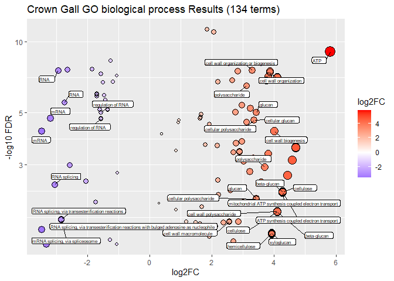
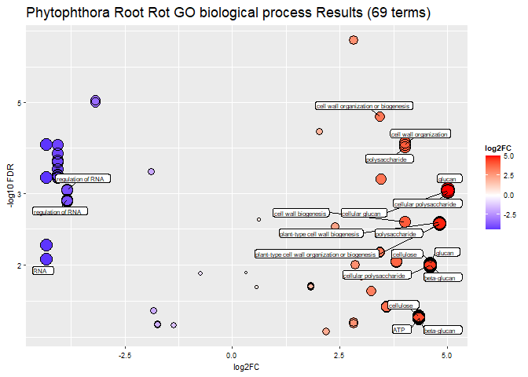
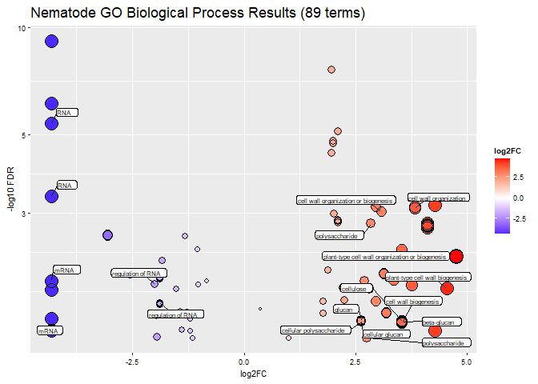
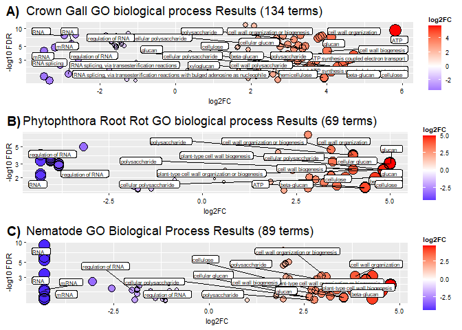
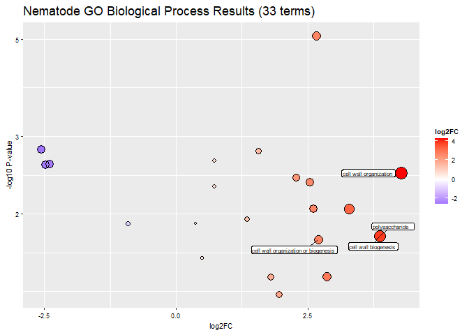

GO\_results\_SCRI\_ROOT\_RNAseq
================
Houston Saxe
1/24/2022

# Load libraries

``` r
pacman::p_load(dplyr, tibble, readr, stringr, data.table, ggplot2, sjPlot, ggpubr, tidyr)
```

# Process analysis files downloaded from <http://pantherdb.org/tools/compareToRefList.jsp>

``` r
# files = list.files('C:/Users/hsaxe/OneDrive/Documents/ALAB/GitHub/SCRI_ROOT_2/GOresults/raw/')
# 
# parse_GO = function(x) {
# 
#   dat = as.data.frame(read_tsv(paste0('C:/Users/hsaxe/OneDrive/Documents/ALAB/GitHub/SCRI_ROOT_2/GOresults/raw/', x), skip = 11))
# 
# filename =  colnames(dat)[1:2] %>%
#   str_extract('CG|PHY|NEM|biological process|cellular component') %>%
#   paste0(collapse = '_') %>%
#   gsub(' ', '_', .)
# 
# 
# colnames(dat) = str_extract(colnames(dat), 'biological process|cellular component|(?<=\\().*?(?=\\))')
# 
# colnames(dat)[c(2,3)] = c('Ref', 'Analyzed')
# 
# dat = dat %>% mutate(log2FC^2 = (Ref + Analyzed))
# 
# write_csv(dat, paste0('C:/Users/hsaxe/OneDrive/Documents/ALAB/GitHub/SCRI_ROOT_2/GOresults/', filename, '_parsed.csv'))
# 
# }
# 
# lapply(files, parse_GO)
```

# GO Biological Process plotting CG

``` r
dat = fread('C:/Users/hsaxe/OneDrive/Documents/ALAB/GitHub/SCRI_ROOT_2/GOresults/biological_process_CG_parsed.csv')

dat = dat %>%
  mutate(GO_term = str_extract(`biological process`, '\\(.*\\)'),
         `fold Enrichment` = as.numeric(ifelse(`fold Enrichment` == '< 0.01', min(`fold Enrichment`), `fold Enrichment`))) %>%
  mutate(`biological process` = gsub('\\(.*\\)', '', `biological process`),
    log2FC = log2(as.numeric(`fold Enrichment`)),
         `-log10 FDR` = log10(FDR)*-1,
    Direction = ifelse(
      log2FC >= 0, 'Pos', 'Neg'
    ))

res_list = list(CG_BP = count(dat, Direction))

labs = dat %>%
  filter(`biological process` %like% 'wall|poly|glucan|cellulose|ATP|RNA') %>% 
  mutate(`biological process` = gsub('metabolic|process|processing|biosynthetic', '', `biological process`))

p1 = ggplot(dat, aes(log2FC, `-log10 FDR`))+
  geom_point(aes(size = log2FC^2, color = log2FC))+
  geom_point(aes(size = log2FC^2), shape = 1, color = 'black')+
  scale_y_log10()+
  coord_cartesian(clip = "off") +
  ggrepel::geom_label_repel(data = labs, aes(label = `biological process`), size = 2, box.padding = 0.4, label.padding = 0.1, max.overlaps = 30)+
  ggtitle(paste0('Crown Gall GO biological process Results (', length(unique(dat$`biological process`)), ' terms)'))+
  scale_color_gradient2(low = 'blue', high = 'red')+
  guides(size = 'none')

p1
```

<!-- -->

``` r
save_plot('GOresults/GO_BP_CG_plot.png', p1)
```

    ## png 
    ##   2

# GO Biological Process plotting PHY

``` r
dat = fread('C:/Users/hsaxe/OneDrive/Documents/ALAB/GitHub/SCRI_ROOT_2/GOresults/biological_process_PHY_parsed.csv')

dat = dat %>%
  mutate(GO_term = str_extract(`biological process`, '\\(.*\\)'),
         `fold Enrichment` = as.numeric(ifelse(`fold Enrichment` == '< 0.01', min(`fold Enrichment`), `fold Enrichment`))) %>%
  mutate(`biological process` = gsub('\\(.*\\)', '', `biological process`),
    log2FC = log2(as.numeric(`fold Enrichment`)),
         `-log10 FDR` = log10(FDR)*-1,
    Direction = ifelse(
      log2FC >= 0, 'Pos', 'Neg'
    ))

res_list$PHY_BP = count(dat, Direction)

labs = dat %>%
  filter(`biological process` %like% 'wall|poly|glucan|cellulose|ATP|RNA') %>% 
  mutate(`biological process` = gsub('metabolic|process|processing|biosynthetic', '', `biological process`))

p2 = ggplot(dat, aes(log2FC, `-log10 FDR`))+
  geom_point(aes(size = log2FC^2, color = log2FC))+
  geom_point(aes(size = log2FC^2), shape = 1, color = 'black')+
  scale_y_log10()+
  coord_cartesian(clip = "off") +
  ggrepel::geom_label_repel(data = labs, aes(label = `biological process`), size = 2, box.padding = 0.4, label.padding = 0.1, max.overlaps = 30)+
  ggtitle(paste0('Phytophthora Root Rot GO biological process Results (', length(unique(dat$`biological process`)), ' terms)'))+
  scale_color_gradient2(low = 'blue', high = 'red')+
  guides(size = 'none')

p2
```

<!-- -->

``` r
save_plot('GOresults/GO_BP_PHY_plot.png', p2)
```

    ## png 
    ##   2

# GO Biological Process plotting NEM

``` r
dat = fread('C:/Users/hsaxe/OneDrive/Documents/ALAB/GitHub/SCRI_ROOT_2/GOresults/biological_process_NEM_parsed.csv')

dat = dat %>%
  mutate(GO_term = str_extract(`biological process`, '\\(.*\\)'),
         `fold Enrichment` = as.numeric(ifelse(`fold Enrichment` == '< 0.01', min(`fold Enrichment`), `fold Enrichment`))) %>%
  mutate(`biological process` = gsub('\\(.*\\)', '', `biological process`),
    log2FC = log2(as.numeric(`fold Enrichment`)),
         `-log10 FDR` = log10(FDR)*-1,
    Direction = ifelse(
      log2FC >= 0, 'Pos', 'Neg'
    ))

res_list$NEM_BP = count(dat, Direction)

labs = dat %>%
  filter(`biological process` %like% 'wall|poly|glucan|cellulose|ATP|RNA') %>% 
  mutate(`biological process` = gsub('metabolic|process|processing|biosynthetic', '', `biological process`))

p3 = ggplot(dat, aes(log2FC, `-log10 FDR`))+
  geom_point(aes(size = log2FC^2, color = log2FC))+
  geom_point(aes(size = log2FC^2), shape = 1, color = 'black')+
  scale_y_log10()+
  coord_cartesian(clip = "off") +
  ggrepel::geom_label_repel(data = labs, aes(label = `biological process`), size = 2, box.padding = 0.4, label.padding = 0.1, max.overlaps = 30)+
  ggtitle(paste0('Nematode GO Biological Process Results (', length(unique(dat$`biological process`)), ' terms)'))+
  scale_color_gradient2(low = 'blue', high = 'red')+
  guides(size = 'none')

p3
```

<!-- -->

``` r
save_plot('GOresults/GO_BP_NEM_plot.png', p3)
```

    ## png 
    ##   2

# Arrange all plots to one

``` r
arr = ggarrange(p1, p2, p3, labels = c('A)', 'B)', 'C)'), ncol = 1)

arr
```

<!-- -->

``` r
sjPlot::save_plot('GOresults/GO_arranged_BP.png', arr, height = 25, width = 20)
```

    ## png 
    ##   2

``` r
# save_plot('GOresults/GO_arranged_BP.png', arr, base_height = 9, base_width = 7)
```

``` r
write.csv(res_list, 'C:/Users/hsaxe/OneDrive/Documents/ALAB/GitHub/SCRI_ROOT_2/GOresults/res_summaries.csv')
```

# Unified GO BP plot

``` r
dat = fread('C:/Users/hsaxe/OneDrive/Documents/ALAB/GitHub/SCRI_ROOT_2/GOresults/biological_process_NA_parsed.csv')

dat = dat %>%
  mutate(GO_term = str_extract(`biological process`, '\\(.*\\)'),
         `fold Enrichment` = as.numeric(ifelse(`fold Enrichment` == '< 0.01', min(`fold Enrichment`), `fold Enrichment`))) %>%
  mutate(`biological process` = gsub('\\(.*\\)', '', `biological process`),
    log2FC = log2(as.numeric(`fold Enrichment`)),
         `-log10 P-value` = log10(`raw P-value`)*-1,
    Direction = ifelse(
      log2FC >= 0, 'Pos', 'Neg'
    ))

res_list$NEM_BP = count(dat, Direction)

labs = dat %>%
  filter(`biological process` %like% 'wall|poly|glucan|cellulose|ATP|RNA') %>% 
  mutate(`biological process` = gsub('metabolic|process|processing|biosynthetic', '', `biological process`))

p3 = ggplot(dat, aes(log2FC, `-log10 P-value`))+
  geom_point(aes(size = log2FC^2, color = log2FC))+
  geom_point(aes(size = log2FC^2), shape = 1, color = 'black')+
  scale_y_log10()+
  coord_cartesian(clip = "off") +
  ggrepel::geom_label_repel(data = labs, aes(label = `biological process`), size = 2, box.padding = 0.4, label.padding = 0.1, max.overlaps = 30)+
  ggtitle(paste0('Nematode GO Biological Process Results (', length(unique(dat$`biological process`)), ' terms)'))+
  scale_color_gradient2(low = 'blue', high = 'red')+
  guides(size = 'none')

p3
```

<!-- -->

``` r
save_plot('GOresults/GO_BP_UNITY_plot.png', p3)
```

    ## png 
    ##   2

\`\`\`
