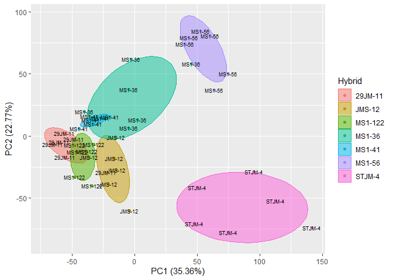
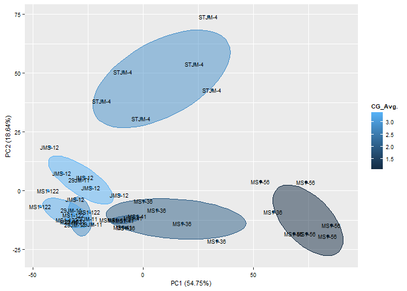
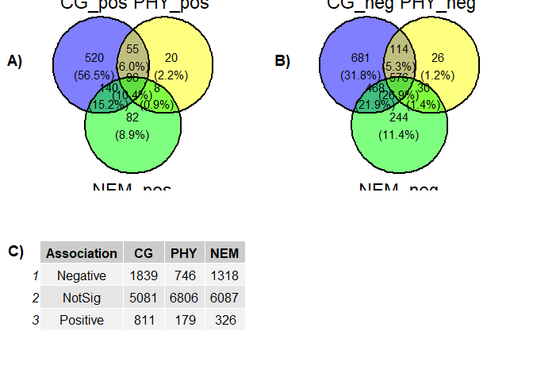
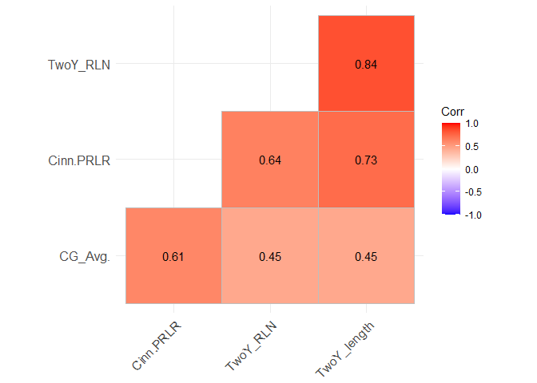

Jm3101\_v1.0\_and\_Walnut\_2.0
================
Houston Saxe
1/28/2022

# Load neccessary libraries

``` r
pacman::p_load(rlang, data.table, ggplot2, ggfortify, stringr, dplyr, statmod, tibble, ggpubr, sjPlot, tidyr, tidytext, OmicsAnalyst, tidytable, gridExtra)
```

# Read in and prepare expression data

``` r
dat = fread("C:/Users/hsaxe/OneDrive/Documents/ALAB/Transcriptome_data/Root/SCRI_ROOT_RNAseq_counts_combined_genomes.txt")

dat$GeneID = gsub("LOC", "", dat$GeneID)


head(dat)
```

    ##       GeneID 29JM-11-1 29JM-11-2 29JM-11-3 29JM-11-4 29JM-11-5 29JM-11-6
    ## 1: 121242473         6         5         8        10        16        20
    ## 2: 121268866         0         0         0         0         0         0
    ## 3: 121241406       210        70       274       445       564       409
    ## 4: 121250192        38        12        40       111       109        76
    ## 5: 121241144         8         6        17        13        33        13
    ## 6: 121255391        76        28       146       196       206       102
    ##    JMS-12-1 JMS-12-2 JMS-12-3 JMS-12-4 JMS-12-5 JMS-12-6 MS1-122-1 MS1-122-2
    ## 1:       11        6       11       14       16       15        23        29
    ## 2:        0        0        0        0        0        0         0         0
    ## 3:      373      410      415      261      439      609       622       674
    ## 4:       88       81      106       79       92      108        80       123
    ## 5:       11        4        5        7        9       16        13        17
    ## 6:       23      102      110      106       85      275       181       181
    ##    MS1-122-3 MS1-122-4 MS1-122-5 MS1-122-6 MS1-36-1 MS1-36-2 MS1-36-3 MS1-36-4
    ## 1:        50        26        54        23       13       11       15       13
    ## 2:         0         0         0         0        0        0        0        0
    ## 3:       618       233       986       368      787      342     1020      531
    ## 4:        91        52       176        70      153       91      228      148
    ## 5:        20        13        32        11        3       15       20        3
    ## 6:       253        69       259       162      331       76      386      180
    ##    MS1-36-5 MS1-36-6 MS1-41-1 MS1-41-2 MS1-41-3 MS1-41-4 MS1-41-5 MS1-41-6
    ## 1:       12       33        9       14        9        7       17        7
    ## 2:        0        0        0        0        0        0        0        0
    ## 3:      491      714      535      231      454      355      618      331
    ## 4:      129      173      101       54       82       73      107       75
    ## 5:        1       17       10        2        7        9        2        6
    ## 6:       14      126      115       88      181      122      235      162
    ##    MS1-56-1 MS1-56-2 MS1-56-3 MS1-56-4 MS1-56-5 MS1-56-6 STJM-4-1 STJM-4-2
    ## 1:       35       21       25       10        0       30        0        6
    ## 2:        0        0        0        0        0        0        0        0
    ## 3:     1122     1017      846      828      155     1116       18       50
    ## 4:      196      242      156      152       46      247       17       33
    ## 5:        1        1        1        2        1        0        0        0
    ## 6:       43       20       77       26       11       15        0        0
    ##    STJM-4-3 STJM-4-4 STJM-4-5 STJM-4-6
    ## 1:        3        9        3        4
    ## 2:        0        0        0        0
    ## 3:       52      184       83       69
    ## 4:       19       58       18       23
    ## 5:        1        6        0        0
    ## 6:        5        7        2        3

# Read in metadata

``` r
metadata = fread("C:/Users/hsaxe/OneDrive/Documents/ALAB/Transcriptome_data/Root/R/Phenotyping/SCRI/LongList3_2Y.csv", stringsAsFactors = T)

head(metadata)
```

    ##    CAL:_Wip_ID...1 CG_Avg. CG_Dec. Cinn.PCLR Cinn.PRLR Pini.PCLR Pini.PRLR
    ## 1:            I8-1    2.40       D         7        30        81        25
    ## 2:            I9-2    2.30       D        22        21        63        14
    ## 3:           Vlach    3.40       K        72        79        59        39
    ## 4:           VX211    3.10       K        57        65        64        44
    ## 5:          29JM-4    3.10       D        24        17        68        31
    ## 6:          29JM-8    2.75       D        55        50        35        34
    ##                  PHY_Dec. TwoY_length TwoY_RLN NEM_Dec. Unity
    ## 1:                      D      124.50      5.0        D D-D-D
    ## 2:                      D      139.75     58.5        D D-D-D
    ## 3:                   SAVE      170.57    112.2        K K-K-K
    ## 4:                   SAVE      133.30     87.4        K K-K-K
    ## 5:                      D       70.10     14.8        D D-D-D
    ## 6: save due to in trials?       77.50     18.7        K D-K-K

# Modify metadata for this analysis

``` r
metadata = data.frame(Sample = colnames(dat)[colnames(dat) != 'GeneID']) %>%
  mutate(Hybrid = as.factor(gsub("\\-\\d$", "", Sample))) %>%
  left_join(metadata, by = c('Hybrid' = 'CAL:_Wip_ID...1'))
  
row.names(metadata) = metadata$Sample

metadata = metadata %>% 
  mutate(PHY_Avg = rowMeans(select(., matches('PCLR|PRLR'))))

head(metadata)
```

    ##              Sample  Hybrid CG_Avg. CG_Dec. Cinn.PCLR Cinn.PRLR Pini.PCLR
    ## 29JM-11-1 29JM-11-1 29JM-11     2.8       D        36        34        45
    ## 29JM-11-2 29JM-11-2 29JM-11     2.8       D        36        34        45
    ## 29JM-11-3 29JM-11-3 29JM-11     2.8       D        36        34        45
    ## 29JM-11-4 29JM-11-4 29JM-11     2.8       D        36        34        45
    ## 29JM-11-5 29JM-11-5 29JM-11     2.8       D        36        34        45
    ## 29JM-11-6 29JM-11-6 29JM-11     2.8       D        36        34        45
    ##           Pini.PRLR PHY_Dec. TwoY_length TwoY_RLN NEM_Dec. Unity PHY_Avg
    ## 29JM-11-1        15        D        96.3     68.9        K D-D-K    32.5
    ## 29JM-11-2        15        D        96.3     68.9        K D-D-K    32.5
    ## 29JM-11-3        15        D        96.3     68.9        K D-D-K    32.5
    ## 29JM-11-4        15        D        96.3     68.9        K D-D-K    32.5
    ## 29JM-11-5        15        D        96.3     68.9        K D-D-K    32.5
    ## 29JM-11-6        15        D        96.3     68.9        K D-D-K    32.5

``` r
fwrite(metadata, 'SCRI_ROOT_RNAseq_metadata.csv')
```

# Plotting metadata

``` r
metaLong = metadata %>% 
  select(!Sample) %>% 
  select(Hybrid, CG_Avg., PHY_Avg, TwoY_RLN) %>% 
  distinct() %>% 
  pivot_longer(where(is.numeric), names_to = 'Trait')

p =ggplot(metaLong, aes(reorder_within(Hybrid, value, Trait), value, fill = Hybrid))+
  geom_col()+
  scale_x_reordered()+
  theme(axis.text.x = element_text(angle = 30))+
  facet_wrap(~Trait, scales = 'free', ncol = 4)

print(p)
```

<!-- -->

``` r
# save_plot('DGEresults/metadata_plot.png', p, height = 10, width = 17)
```

# Center and scale predictors to make comparisons more interpretable in results

``` r
metadata_S = metadata %>%
  mutate_if(is.numeric, scale)
```

# Limma needs GeneIDs as rownames in expression data. Also, colnames of expression data need to match rownames of metadata

``` r
dat1 = dat %>%
  column_to_rownames(var =  "GeneID") %>%
  as.matrix()

## Do colnames in data match rownames in metadata? If they don't, use match(x,y) produces the order of y required to match the order of x

all(colnames(dat1) == rownames(metadata_S))
```

    ## [1] TRUE

``` r
# Names match

# If they didn't match, use below code
## What order do rows of metadat need to be in to match colnames of dat1?
# match(colnames(dat1), rownames(metadata))

## Reset rownames
# metadata = metadata[match(colnames(dat1), rownames(metadata)),]

# all(colnames(dat1) == rownames(metadata))
# now they match
```

# Microcarpa annotation

``` r
annotation_Jm = fread("C:/Users/hsaxe/OneDrive/Documents/ALAB/Genome_info/Genomic_Annotation_2/Jm_x_Jr/Jm_x_Jr_Genomic_annotation.csv")

## Extract everything but class mRNA and other isoforms. This reduces duplication in the data
annotation_Jm = annotation_Jm %>%
  filter(feature != "mRNA", !grepl('\\sX[2-9]$|\\sX1[0-9]$', name)) %>%
  mutate(GeneID = as.character(GeneID)) %>% 
  mutate(Parent_haplotype = "J.microcarpa")

head(annotation_Jm)
```

    ##    feature        class chromosome  start    end
    ## 1:   ncRNA       lncRNA         1D      7   1181
    ## 2:   ncRNA       lncRNA         1D  14257  15054
    ## 3:     CDS with_protein         1D  27395  59712
    ## 4:     CDS with_protein         1D  85492 108529
    ## 5:     CDS with_protein         1D  85492 108529
    ## 6:     CDS with_protein         1D 137771 144108
    ##                                                         name    GeneID
    ## 1:                              uncharacterized LOC121242473 121242473
    ## 2:                              uncharacterized LOC121268866 121268866
    ## 3: LOW QUALITY PROTEIN: uncharacterized protein LOC121241406 121241406
    ## 4:          membrane-bound O-acyltransferase gup1 isoform X1 121250192
    ## 5:          membrane-bound O-acyltransferase gup1 isoform X1 121250192
    ## 6:                  pectin acetylesterase 12-like isoform X1 121241144
    ##    product_accession Jr-GeneID Jr-chromosome         Subcell_loc Score
    ## 1:    XR_005935900.1        NA                                      NA
    ## 2:    XR_005941271.1        NA                                      NA
    ## 3:    XP_040995100.1 108981175             7             nucleus  1.00
    ## 4:    XP_041005135.1 108980963             7 endomembrane system  0.92
    ## 5:    XP_041005135.1 108980963             7 endomembrane system  0.92
    ## 6:    XP_040994724.1 108980844             7 extracellular space  0.77
    ##            ID                                           Name           Category
    ## 1:                                                                             
    ## 2:                                                                             
    ## 3:                                                                             
    ## 4:    PC00042                                acyltransferase                   
    ## 5: GO:0016746 transferase activity, transferring acyl groups                   
    ## 6: GO:0009505                           plant-type cell wall cellular_component
    ##    Parent_haplotype
    ## 1:     J.microcarpa
    ## 2:     J.microcarpa
    ## 3:     J.microcarpa
    ## 4:     J.microcarpa
    ## 5:     J.microcarpa
    ## 6:     J.microcarpa

# Regia annotation

``` r
annotation_Jr = fread("C:/Users/hsaxe/OneDrive/Documents/ALAB/Genome_info/Genomic_Annotation_2/Jr/Jr_Genomic_annotation.csv")

## Extract everything but class mRNA and other isoforms. This reduces duplication in the data
annotation_Jr = annotation_Jr %>%
  filter(feature != "mRNA", !grepl('\\sX[2-9]$|\\sX1[0-9]$', name)) %>%
  mutate(GeneID = as.character(GeneID)) %>% 
  mutate(Parent_haplotype = "J.regia")

head(annotation_Jr)
```

    ##    feature        class chromosome start
    ## 1:     CDS with_protein          1     6
    ## 2:     CDS with_protein          1  7068
    ## 3:     CDS with_protein          1 18754
    ## 4:     CDS with_protein          1 18754
    ## 5:     CDS with_protein          1 18754
    ## 6:     CDS with_protein          1 18754
    ##                                                 name    GeneID
    ## 1:             auxin efflux carrier component 2-like 118344036
    ## 2:             probable WRKY transcription factor 17 118348327
    ## 3: KH domain-containing protein HEN4-like isoform X1 108990460
    ## 4: KH domain-containing protein HEN4-like isoform X1 108990460
    ## 5: KH domain-containing protein HEN4-like isoform X1 108990460
    ## 6: KH domain-containing protein HEN4-like isoform X1 108990460
    ##    product_accession         Subcell_loc Score         ID
    ## 1:    XP_035539669.1 endomembrane system  0.78           
    ## 2:    XP_035545773.1             nucleus  1.00           
    ## 3:    XP_018819971.1             nucleus  1.00    PC00031
    ## 4:    XP_018819971.1             nucleus  1.00 GO:0005634
    ## 5:    XP_018819971.1             nucleus  1.00 GO:0010468
    ## 6:    XP_018819971.1             nucleus  1.00 GO:0010467
    ##                             Name           Category Parent_haplotype
    ## 1:                                                           J.regia
    ## 2:                                                           J.regia
    ## 3:        RNA metabolism protein                             J.regia
    ## 4:                       nucleus cellular_component          J.regia
    ## 5: regulation of gene expression biological_process          J.regia
    ## 6:               gene expression biological_process          J.regia

# Combine Jm and Jr annotations

``` r
annotation_combined = annotation_Jm %>%
  rbind(annotation_Jr, fill = T)

fwrite(annotation_combined, 'DGEresults/annotation_combined.csv')

BP_anno = annotation_Jm %>% 
  distinct(`Jr-GeneID`) %>% 
  rbind(distinct(annotation_Jr, GeneID), use.names = F) %>% 
  distinct(`Jr-GeneID`) %>% 
  mutate(`Jr-GeneID` = paste0('LOC', `Jr-GeneID`))

fwrite(BP_anno, 'GeneIDs_for_annotation_with_GO.csv')
```

# Create DGEList object

``` r
library(edgeR)
```

    ## Loading required package: limma

``` r
dds = DGEList(dat1)

dim(dds$counts)
```

    ## [1] 67924    42

``` r
## Calculate library normalization factors (does not do anything to data)
dds = calcNormFactors(dds)

## These are the size factors (normalization factors) for each sample
# dds$samples
```

# Filter by max CPM of 75 (This is used for DGE analysis)

``` r
d = expression_filter(dds, DGEList = T, FilterFUN = max, FilterThreshold = 75)
```

    ## Make sure no numeric identifiers are in data as this will negatively impact filtering

    ## [1] "Data has no missing values"
    ## [1] "Removed 60193 features based on max threshold of 75, 7731 remaining"

``` r
## CPM normalized counts of all data
cpm = cpm(dds, prior.count = 2, log = F) 

cpm = cpm %>% 
  data.frame() %>% 
  rownames_to_column(var = 'GeneID') %>%  
  rename_with(~ gsub('X', '', gsub('\\.', '-', .x)))

fwrite(cpm, 'DGEresults/cpm_plotting_data.csv')

## CPM normalized counts of filtered data
cpmd = cpm(d)
```

# Less conservative threshold for looking at expressed genes

``` r
# d2 = expression_filter(dds, DGEList = T, FilterFUN = mean, FilterThreshold = 20)
# 
# fwrite(as.data.frame(d2$counts), 'DGEresults/CPM_20_filtered.csv', row.names = T)
```

## Cluster visualization

``` r
## MDS visualization
# plotMDS(d, col = as.numeric(metadata$Hybrid), cex=1)
```

# Plot PCA to look in R

``` r
pca = plot_pca(cpmd, metadata,
               join_by_name = 'Sample',
               plotting_factors_in = 'col_names',
               plotting_factors_name = Hybrid, 
               x = 'PC1',
               y = 'PC2',
               scale = T, 
               center = T, 
               color = 'Hybrid',
               fill = 'Hybrid',
               plot_type = '2D')
```

    ## Make sure no numeric identifiers are in data as this will drastically impact PCA

    ## Joining, by = c("Sample", "Hybrid")

``` r
pca$plot
```

<!-- -->

# Plot PCA to save

``` r
# a = plot_pca(cpmd, metadata, sample_colname = 'Sample', sample_names_in = 'col_names', x = 'PC1', y = 'PC2', scale = T, center = T, color = 'CG_Avg.', fill = 'CG_Avg.', plot_type = '2D', group_by = 'Hybrid')
# 
# b = plot_pca(cpmd, metadata, sample_colname = 'Sample', sample_names_in = 'col_names', x = 'PC1', y = 'PC2', scale = T, center = T, color = 'Cinn.PRLR', fill = 'Cinn.PRLR', plot_type = '2D', group_by = 'Hybrid')
#           
# c = plot_pca(cpmd, metadata, sample_colname = 'Sample', sample_names_in = 'col_names', x = 'PC1', y = 'PC2', scale = T, center = T, color = 'TwoY_RLN', fill = 'TwoY_RLN', plot_type = '2D', group_by = 'Hybrid')
# 
# 
# save_plot('PCA_Hybrids.png', ggarrange(a, b, c, labels = c('A', 'B', 'C'), ncol = 3), base_height = 3, base_width = 12)
```

# PCA boxplot

``` r
pca = plot_pca(cpmd, metadata,
               join_by_name = 'Sample',
               plotting_factors_in = 'col_names',
               plotting_factors_name = Hybrid, 
               x = 'Hybrid',
               y = 'PC1',
               scale = T, 
               center = T, 
               color = 'Hybrid',
               fill = 'PHY_Avg',
               plot_type = 'boxplot')
```

    ## Make sure no numeric identifiers are in data as this will drastically impact PCA

    ## Joining, by = c("Sample", "Hybrid")

``` r
pca$plot_dat
```

    ##       Sample        PC1         PC2          PC3         PC4         PC5
    ## 1  29JM-11-1 -55.390801 -17.1042371   9.84752922  49.3231454   3.4621396
    ## 2  29JM-11-2 -60.305695  -4.7156741   3.32222995  48.0608100   8.6833663
    ## 3  29JM-11-3 -55.698593   2.3696713  17.61733710  38.6568906  10.9164531
    ## 4  29JM-11-4 -48.283188  -2.2726269   5.86738064  22.7083872  11.4494385
    ## 5  29JM-11-5 -65.126956  -6.8015065  10.38507652  53.3816257   7.0801041
    ## 6  29JM-11-6 -22.919619 -29.3444232   6.19111513   2.9716154   4.4377344
    ## 7   JMS-12-1  -3.982564 -60.2440101 -28.41776108 -18.9788140  26.3427434
    ## 8   JMS-12-2 -14.809041  -0.8759501  10.88507730 -18.5713778 -44.1799771
    ## 9   JMS-12-3 -14.366905 -27.5386911  -0.21530917 -14.3213894  19.4886096
    ## 10  JMS-12-4 -21.108918 -38.6303925 -10.76802705 -15.5991075  23.2919276
    ## 11  JMS-12-5 -16.417235 -17.8360558 -10.24359881 -15.5343815   7.8986930
    ## 12  JMS-12-6 -36.211049 -16.9487099   0.98310002  -8.5341254  14.3346202
    ## 13 MS1-122-1 -48.178885  -7.1131835 -38.24534498 -11.1198594 -25.2669849
    ## 14 MS1-122-2 -32.544058  -6.6642528 -40.83136277 -17.9935520 -39.9937679
    ## 15 MS1-122-3 -48.113126 -33.1947532 -46.43622440  -8.1548774   9.0723547
    ## 16 MS1-122-4 -34.004552 -40.2372230 -35.11778705  -8.4218058   2.0749339
    ## 17 MS1-122-5 -38.104392 -12.2324179 -41.44157304  -9.6352850   5.9797336
    ## 18 MS1-122-6 -45.411578 -12.5650434 -34.94361263  -5.5011821 -14.1641991
    ## 19  MS1-36-1  -2.877870  61.9767688  57.22484513 -38.4315816  14.3065799
    ## 20  MS1-36-2  -4.709077   6.2484909  26.62361203 -25.8609145   6.3425568
    ## 21  MS1-36-3 -40.111547  19.5059679  46.66475496 -14.0748911  12.6167264
    ## 22  MS1-36-4  -4.381018  37.3407780  33.13491818 -27.1553241   8.3584939
    ## 23  MS1-36-5  45.352878  57.9378284  -1.98901348  -8.3051378   6.1787443
    ## 24  MS1-36-6   2.569308  12.9402469  -0.09708251 -19.1335492   8.7385900
    ## 25  MS1-41-1 -19.259969  15.4090970  13.46730190 -11.9974166 -19.4303341
    ## 26  MS1-41-2 -26.720903  14.4272922  32.84449081  -3.8394172 -11.7596286
    ## 27  MS1-41-3 -33.058021   9.8727076  17.81106447  -6.5600837  -4.9589933
    ## 28  MS1-41-4 -34.862537  13.1207446  17.70765198  -1.3601234 -55.8867569
    ## 29  MS1-41-5 -35.705559  16.0405506  17.42825331  -1.1078064  -5.7144946
    ## 30  MS1-41-6 -44.307921   6.0366421  29.87918413  13.7636377  -1.0471701
    ## 31  MS1-56-1  40.480094  74.2676337 -30.20898714   6.9739567   3.4380690
    ## 32  MS1-56-2  60.502735  80.8078138 -34.05225369  11.1027762   7.4036883
    ## 33  MS1-56-3  43.776483  79.2375875 -12.01394529  -0.4424058   8.9821812
    ## 34  MS1-56-4  53.065455  84.6238250 -26.44973396   8.0231913   7.9892775
    ## 35  MS1-56-5  63.452890  36.9727133  -9.26296642  17.0385426   0.0205465
    ## 36  MS1-56-6  74.964428  50.0859577 -22.52543579  13.0086631   2.3782210
    ## 37  STJM-4-1 112.829087 -52.3428023  13.84672309  39.8417269 -18.3457518
    ## 38  STJM-4-2 141.584480 -74.0756766  23.94335878   6.1015327 -11.4338114
    ## 39  STJM-4-3  74.895249 -77.5041365   9.56694960 -13.7473783  10.7463691
    ## 40  STJM-4-4  50.230721 -41.6269028   7.51840300  -5.3268132   1.7918915
    ## 41  STJM-4-5  95.386970 -28.7757032   7.88260085  13.0748382 -11.9861307
    ## 42  STJM-4-6  47.880800 -70.5779448   2.61706118 -14.3227396  10.3632130
    ##             PC6          PC7         PC8         PC9        PC10        PC11
    ## 1  -16.80743470   9.18701311  -5.3453967  13.8930191  -4.0074993   1.0862168
    ## 2   11.01729009  11.51320118   4.9385947  -9.0943934   9.0825170   9.7669349
    ## 3   -4.10305215   9.36145065   2.4093555  -6.8241081   7.4891799  -1.6388256
    ## 4   -0.48063295   2.61913931   2.6897222  -7.5370502   4.8581123  -1.7313738
    ## 5  -18.11091086  18.54999913  -5.8623197  10.0168311  -0.0957085  -9.4306095
    ## 6  -17.88301144 -24.37662861  -5.2595491  22.4997909 -25.3757542 -10.9480467
    ## 7   -9.05553008   7.47789449  18.8863385  -8.1990477  -2.4240886  -4.1212414
    ## 8  -23.81326209  17.47567063  28.8132649  -0.4092704 -13.2283770 -12.6717976
    ## 9   -2.57865801  -4.99291676  17.1617435 -12.2590169  -2.6146166  -6.6759529
    ## 10  -2.32182182   0.02398235  20.8161814 -12.1673831  -7.2509445  -6.5773642
    ## 11  -3.48384993  -1.75071109  15.1072616 -12.8808892   0.5735561 -10.2633058
    ## 12  -3.05895437  -7.08611783  11.8822269 -13.2422086 -12.1627615  -9.7736162
    ## 13  11.15517403  17.10465282  -7.3886147  -7.7886134   6.5226894   5.7810021
    ## 14   1.34943826  18.10948480  -6.5824789   0.8051239   1.9541024   2.1718580
    ## 15  14.16067255  -0.12933668 -18.1244618   5.7572792  -6.8411059   2.0765700
    ## 16  11.93454480  -7.37967183 -16.9770065  22.4300260 -12.3967112   4.7392349
    ## 17  14.69791320  -3.69809116 -14.6161225  -7.6370029   0.7548592   1.5856321
    ## 18  17.06011221   2.76505389 -11.6170949   3.9529927   1.0450222   0.9877438
    ## 19  12.37581729  31.13188412 -15.4428029   0.4947438 -29.2604123  17.1370996
    ## 20  13.48642591  -0.29135829  -3.1351108  17.6804749  20.0991881 -14.3913897
    ## 21  11.88894907  21.07589872 -12.0734732   4.3111201   0.1037178  -5.8100579
    ## 22  14.99312891   6.52029098  -2.3767530  -6.2694959  10.4705231  -8.1411083
    ## 23  -0.79610915   9.55889467   3.6904779   2.8690949   7.1279076 -10.8502004
    ## 24   7.61374755  -4.32747345   1.1930333  24.0126379  23.6250374 -13.1533042
    ## 25   0.09003114 -21.57923526   2.7833842  -5.6441823   6.5802442   0.7932166
    ## 26   0.50892717 -37.07761433  -2.1221408   3.2307872  -4.4242039   9.0791150
    ## 27   2.55598394 -24.98087274  -2.3828577  -8.8451891   3.9307354   2.5322204
    ## 28 -18.56252163   3.74916536  12.2297608   2.6675179   4.0378006   5.8609315
    ## 29   5.41686279 -25.31616403  -3.3779298 -12.2583402   4.6068404   8.7205859
    ## 30  -0.34832877 -17.24446853  -5.9824077  -3.4258087   5.7090595  10.4655829
    ## 31  -6.47048528  -4.11665773  -6.6775704 -16.0911908   9.7723742  -4.2437759
    ## 32 -13.12154538   0.50956125  -1.0369363  -7.5479948  -0.5425288   4.4276195
    ## 33 -10.22348582   3.61772962   3.3384989  -4.9923037  -5.1234771  12.1595891
    ## 34 -15.24455291  -1.93752237  -0.2613485  -3.9733945  -6.0937225   8.9057597
    ## 35  30.05372548   0.34783455  33.3519623  36.7298841   0.2003822   1.3288896
    ## 36 -10.48912990 -12.31435378  -3.2610388  16.7915324  -5.9706512  -6.7743139
    ## 37  57.73765795  -0.31264057  17.9216116 -14.0316244 -12.4441720   3.7315696
    ## 38 -14.83489102   9.28190237 -26.3594688  -0.6441522   2.8206936 -12.0393489
    ## 39 -18.56962919  10.55541057   1.7981946   1.5625091  20.3487980  25.0874484
    ## 40 -11.38086067  -7.82852915  -5.9868233  -5.5654675  -2.1508210   2.9928558
    ## 41   1.36765316  -3.56665780 -25.9402459 -17.1025510  -3.9108216 -18.4041603
    ## 42 -17.72539737  -0.22909260   9.1783401  14.7253137   4.6050370  26.2221171
    ##           PC12         PC13        PC14         PC15        PC16        PC17
    ## 1   -8.1573996   1.48198120  -3.1072816   0.12977649   5.4369516  -6.3527755
    ## 2   -7.1135848  10.57240404  10.6226170  -7.08651574   3.2492973  -2.4088980
    ## 3    6.5246376  -5.10977258   3.9406245  -4.16670820 -10.1177147  11.0528028
    ## 4   -0.7274614  -7.50378414   8.0530938  -0.02971088  -9.4956971   9.3575563
    ## 5   -2.4785764  -2.39688207  -3.4462841   9.32109708   8.7161010  -6.4438826
    ## 6  -14.2382791   1.27990732   6.4057533   7.69652709   7.6213459   9.8618631
    ## 7    8.7683059   3.56106598 -12.5116263   2.91586177   5.0649324 -19.5787096
    ## 8   -5.4274383  -1.75211647   0.5936889  -2.60739533  -1.4667261   7.7429087
    ## 9    4.2220488  -1.62216856  -0.6913918  -2.76708710  -4.1929659   3.7893707
    ## 10   9.3791699  -1.68543241  -2.0521694  -5.92656758  -2.7594043  -1.4529236
    ## 11  -7.5850336   3.89926218   6.0505686   8.07596019   7.1956373   3.7118723
    ## 12   5.9418145  -3.98966333   4.1610778  -0.44660299  -4.4448137   4.9745714
    ## 13   3.9042648   3.44888117   0.6597686   2.74445378  -0.9100856   2.9043991
    ## 14  -1.3079229   6.69254664   0.8815725   4.66855050   1.3571789   2.8182364
    ## 15   9.5788930  -6.04714833  -0.9811886 -11.29598126   3.8968795  -1.5211398
    ## 16   0.7259580  -6.15478589  -2.5093316 -11.35020190  -2.2561362   0.5124700
    ## 17   0.1100690  -2.54332890   4.8710269   3.23983793  -3.8802078  -0.3518285
    ## 18  -2.8575241   0.59407829   3.2149845   8.46285749   4.6356103   2.5971018
    ## 19  -4.2496945  -6.30168857   8.6485285   5.29454414  -6.6587244  -5.1293603
    ## 20  -2.3144549   9.39487108  -8.8687935 -13.02443851  14.5798673  13.3143451
    ## 21   8.2478492  10.82938279 -23.6526836  12.92595234  -2.3553253  -0.7481860
    ## 22  -0.6286931   8.10856732   3.1898189  -7.26505899   8.1965058   6.8379007
    ## 23  -9.1269275  -7.62580255  10.5186285 -12.20893532  10.3371507 -19.9164888
    ## 24 -22.3288815 -22.12576822   0.3860330   2.36886488 -20.1727006  -4.8128167
    ## 25  -1.7594866   0.59658817   1.4868833   9.77044107   5.1984576  -7.9325503
    ## 26   6.0043869   2.17947738   0.3919388   1.36468093  13.4247504  -1.9167505
    ## 27   1.4095797  -5.01252341   1.5709660   5.04292892  -1.4417786  -6.9908069
    ## 28   7.2918976  -5.88706072  -6.8594517 -10.00291556  -7.0978987  -7.4433966
    ## 29   0.1119407  -1.50396539   3.7626888   5.60980496  -0.8781841  -4.3503698
    ## 30  15.7773238  -0.02541554  -7.3709320 -12.16386896  -7.9552516  -0.6615079
    ## 31  -7.1726090   1.47926767  -4.5009024  12.93614360   2.4454731   1.1120421
    ## 32  -0.6368489  -0.63432201  -5.9173126   0.42985500   4.7200200   2.3031269
    ## 33   0.6214821  -3.44035870   5.3394105 -11.66266801   5.1892593   5.6811937
    ## 34  -2.8873476  -1.89583602  -6.0040710  -4.18437686   1.9237607   5.8620848
    ## 35  23.4614260  13.28467773  18.5114530   9.81779768  -4.0282572  -2.6975033
    ## 36  10.9459328   2.21863159 -17.9885626   3.10222297 -12.6198128   2.8610765
    ## 37 -15.9970258 -12.83606651 -15.8428992  -0.64803244   5.0830794   2.5647440
    ## 38  20.4147203 -17.41266555   9.1320888  -2.52406919   9.8886799  -0.8019763
    ## 39   6.7402681  -7.64912719   2.4173220  15.33440612   3.0193679   9.2895303
    ## 40  -9.5490796   3.01373409   2.9331822   2.25849850  -9.5286278   0.1016090
    ## 41  -3.3150230  29.12754191   8.2347237  -4.57957893 -15.6872610  -5.2772874
    ## 42 -20.3226764  19.39281653  -3.6735602  -9.57034967  -3.2327331  -2.4616471
    ##            PC18        PC19         PC20        PC21        PC22          PC23
    ## 1   -1.72754750  -5.8086271   4.49284503   1.0112443  12.6488287  -3.737993121
    ## 2   -7.14148845  21.2590106   4.47669324 -13.7477932 -11.9917312   0.454744528
    ## 3    6.61249088  -2.6888750  -0.69586403   7.3889338   1.4293376  -0.779695567
    ## 4    6.07340665  -2.5271794  -3.85641545   3.6195406  -6.3937462  -4.059892889
    ## 5   -0.07460684  -4.3691379  -0.50145716   3.2294072   8.3021816   3.120441363
    ## 6   12.18712769  -0.5172267  -0.95022342   0.2303975 -14.8846530   2.640419238
    ## 7   15.61779992   2.3749542  -0.27656398  -8.4884525   0.1954873  -3.956061532
    ## 8  -14.86854788   1.1332611   3.57672738  -5.7468317   3.6963076   2.250945496
    ## 9   -0.41389236   0.8136157  -0.22319613   1.0579674   2.0920944   2.135337387
    ## 10   0.27312721  -0.7408748  -1.35243353   1.3003090   1.5489066   0.003938178
    ## 11   0.54588078   2.9856909  -2.09863914  -0.4763266   2.2637847  -5.449020047
    ## 12  -9.63642032   0.4609403   1.70296939   3.5480634   1.6262270   6.250865570
    ## 13   5.53184429  -0.4432082  -0.36289706   4.1908252   1.5791693   7.419963368
    ## 14  11.75317278   7.0312829  -0.11732417   4.1230277  -0.2033440  10.644957056
    ## 15 -13.19637217  -2.1739083   3.06510665  -2.9424416   1.0602085  -0.233766078
    ## 16  -6.14665233  -5.7505308   1.11546045  -2.9233893  -2.7033431  -6.631467772
    ## 17   4.02065935   3.0676798   2.23518431   3.0947022   2.0493550   0.870315014
    ## 18  -3.98371530  -5.8280222  -5.15082421   1.6060378   0.3347772  -7.541905598
    ## 19   6.00850043   7.0410149   5.83529744  -1.6251225   5.3457348  -5.716011597
    ## 20   5.63925428   2.5403425   4.96323052  -6.0395175   2.7958102  -7.768387257
    ## 21 -10.59517701  -4.5789173 -12.17298723  -1.9201960 -12.7121236   6.497916555
    ## 22   0.43520979  -2.3558958   4.71766848  10.6434393   4.1214624  -2.168055285
    ## 23  -2.04679452  -7.9140319   9.86903696  12.0488730 -12.4776633   7.741889789
    ## 24   1.67055340   3.3916889  -5.47272504 -10.9269025   5.6764391   6.536323760
    ## 25  -0.72550351  -2.6031906  -3.50385078   1.2589169   0.9959758  -4.886391494
    ## 26   3.29483342   3.6838338   2.88565819  -7.0986976   7.7153894  10.690561692
    ## 27  -8.10749606  -0.9105949  -1.80538589   3.3043786  -0.8322140  -0.916729632
    ## 28   5.45748536  -2.9339386   0.04694387  -1.8576975  -7.4353429 -11.470574798
    ## 29  -6.53118833   2.9872905   0.61185820   1.1488306   2.2056783  -1.122609545
    ## 30   8.39748258  -2.3634392  -0.88712442   1.9583004  -1.3358801   4.449828999
    ## 31  -2.11881061   5.3281942  -0.82317988   3.2339193   0.4331999  -8.484372781
    ## 32  -3.25140859  -2.5709463  -3.33089054  -4.0993616  -1.7865002  -1.018595915
    ## 33   4.96747964  -7.4652170 -12.34468452  -7.0270808   3.5999148   3.865224309
    ## 34  -0.28043491  -3.1435228  -3.15131009  -6.1102454  -0.4305668   1.626726973
    ## 35  -0.95222669  -2.9495858  -4.43254968   0.3855333   0.9356444  -2.087922856
    ## 36  -1.00091080  14.9378082  15.45319428   8.8277886   0.9435949   0.177174763
    ## 37   3.26907076  -2.7194953   1.02404861   1.8997616   0.3665305   1.492239339
    ## 38  -1.98100630  13.4920896 -12.58444843   2.0867583   0.8535775  -1.094077086
    ## 39  -2.55990485 -11.6151889  16.58362179  -6.6459903  -3.7259071   3.184046073
    ## 40  -0.11850552  -3.1143368   1.07859379   2.8230403  -5.7434094  -6.951891972
    ## 41   1.34245400 -10.8942412   3.71209526 -10.1461108   3.9129330   2.311857724
    ## 42  -5.63922237   6.4514347 -11.35125906  13.8021608   3.9278747   1.709705648
    ##           PC24        PC25         PC26       PC27        PC28         PC29
    ## 1   -5.7604782  -6.9381391   3.36761536  1.4629840   3.3862049   0.76437519
    ## 2    1.2237590  -5.3588724   0.08226411 -0.6448224  -1.9325800   1.38484401
    ## 3    3.0513472   7.4152404  -2.72917698  0.7120960   2.6919653   8.93616395
    ## 4    4.0561908   4.9625663  -0.73414877 -1.1977945   6.8529835   2.60913516
    ## 5    0.7231146   0.6235665  -3.61535873 -1.7992093  -2.9736138  -6.49139685
    ## 6   -3.4051608  -0.4791805   1.73512436 -6.2202880  -3.2515884  -0.25421975
    ## 7   -1.6982450   0.5043351   0.18688174  1.8076347   1.4160823   6.60825458
    ## 8   -1.6879769   3.7734617  -0.51380270  7.5688364  -1.1427056   3.27864524
    ## 9   -1.4102883  -1.9022850   4.47249434 -0.3206380   0.1534706  -0.15399373
    ## 10   0.2102313  -4.8355744   3.31929933 -4.7393695  -1.4645769  -0.14234834
    ## 11  11.8241236   6.0357957 -11.03182036  4.2239347   1.0031177 -11.28797104
    ## 12  -3.5421554  -1.7644942   8.09841012 -3.1586867  -2.1436082  -1.92394400
    ## 13  -1.1038709  -3.2449947   0.59777074 -0.7248612   7.4830247   1.25387449
    ## 14  -6.2961301  -1.3453778  -0.32138051  0.1395523   1.1240935  -3.18012631
    ## 15   0.7886205   5.0185360  -7.76069437 -4.9927874  -2.4224489  -3.42148923
    ## 16  -3.9201525   2.8907849  -4.60330686  2.6497398   1.2926948   5.22737920
    ## 17  -2.6304534   1.9629195  -3.31545730  1.9644830  -2.1930816  -2.87235258
    ## 18  14.9442908  -5.6123334  15.11546708  5.3330021  -5.6004064   4.85174350
    ## 19   1.3302070   3.7188699   3.06548786 -0.7019839   0.5743049  -2.20411448
    ## 20  -2.8256935   1.5819530   6.86948327  1.3185122   5.4951045  -6.63222701
    ## 21   0.6185188  -0.4031084  -3.32347146  1.3125785   0.4725945   1.27222743
    ## 22  -4.0565381  -7.5886649  -8.02935552 -5.3436809  -4.6646268   8.59667319
    ## 23   3.8724534   3.1185413   2.80619269  4.3302972   1.0542189   0.01247145
    ## 24   0.1392970  -1.0126472  -0.39400580 -1.4422371  -1.9726001   1.29973265
    ## 25   6.8137337  -3.3319386  -3.22089787 -4.4046795   3.4381348   1.28611046
    ## 26   4.7078975   6.2003247  -3.31589488  4.7961261  -0.3613281  10.31057651
    ## 27  -4.6331289  -3.4073609   1.07803290 -3.8619305   5.3071513  -5.26007241
    ## 28   0.6033267   0.6528232  -1.53491503 -9.0215331  -3.8591538  -1.55367416
    ## 29  -5.9499089  -1.0502981   2.58359923 -1.9471268   5.3245189  -1.86832870
    ## 30  -0.5438869   3.7220099   4.81636934 10.9472024  -8.7566478  -8.99574994
    ## 31 -10.2384075   7.6434964   1.24312000  0.7340040 -13.1044266   3.48263320
    ## 32  -4.6436950   8.6627748   4.51918458 -0.7460411   6.5594166   0.64725800
    ## 33   2.6395275 -11.9923134  -5.39013152 -0.5917105  -6.9994409  -2.28503196
    ## 34   2.6194456  -2.0804349   1.23700645 -0.7143747   8.6581232  -0.85613254
    ## 35  -4.8935732   1.4243214  -0.73332325  1.2010052   0.2662103  -1.45003665
    ## 36  10.1853968  -6.5488497  -2.19078543 -1.2462410   0.5553294  -0.20897315
    ## 37  -0.5353061   0.5811685  -0.71130878 -1.2280537  -0.7863338  -1.15977508
    ## 38  -0.3128623  -0.5402747   1.44584034  0.3172984   1.4694890   0.96378481
    ## 39   0.9360075   0.1635448   0.47315199 -3.3582309  -2.9759844  -0.89566851
    ## 40  -6.6469898 -10.3842604  -6.82196749 15.9717429   3.4615896   0.05695288
    ## 41   2.9094897   3.1753920   1.43034922 -4.8712665  -0.5800503  -0.20770163
    ## 42   2.5379225   5.9889766   1.74805859 -3.5134828  -0.8546205   0.46249215
    ##           PC30        PC31        PC32        PC33       PC34         PC35
    ## 1   0.18698293  8.91081687  0.92965992 -6.40150373 -7.8201473  -2.66681896
    ## 2  -1.24603981  0.86020542 -0.05960562  2.91912899  0.1979030  -0.42624642
    ## 3   1.63870305 -5.28194668  1.09181080  0.03591531 -2.5071228   5.86862413
    ## 4   0.14224104 -0.32958184 -4.72845089 -4.53406438  1.1314484  -2.33277051
    ## 5   0.25393374 -7.51565830  0.07878634  7.80165830  7.0612278   0.08721337
    ## 6  -1.55418144  2.15094340 -1.03116864 -2.64194736  3.2299135  -0.82807918
    ## 7  -4.23430699 -2.51626913 -1.18652305 -4.57080569  3.7885177   3.41658322
    ## 8  -6.94537275 -3.53210770 -3.89071560 -3.08309060  3.6241869  -1.43022777
    ## 9   0.38278969 -0.33689627 -2.78081076  5.35333568 -1.9277582  -4.18361919
    ## 10  4.02336240  2.53972109  1.10319962  4.48391944 -2.0497682  -1.01244790
    ## 11 -1.31218498  9.27702606  2.46942471 -1.17371659 -4.6213817   2.15426101
    ## 12  5.93747422 -0.29953511  4.41404256  0.93767628 -3.1833439   2.23062762
    ## 13  4.09899567  7.72147569 -9.39665980 -1.19149116  4.9027479  -5.01603384
    ## 14  0.54846242 -1.53595014  3.76716699  3.48205438 -5.1963750   8.49393102
    ## 15  8.64711521  0.03972481 -0.08752789 -5.85322306  7.0714777   2.82856306
    ## 16 -7.54246166  1.56302871 -4.40586246  8.61566422 -7.1342001   2.96030894
    ## 17 -7.13200865 -9.81947578  7.51485677 -3.16669437 -3.5885867 -13.21176090
    ## 18 -0.50313860 -0.65995987  3.75726113 -0.75269835  2.9199983   1.77005762
    ## 19  1.67541901  0.11925985 -1.45598154  1.59881379  0.8837164   0.45823224
    ## 20  4.25648849 -6.55650651 -2.49672910 -0.45348340 -1.0975675  -0.47997950
    ## 21  0.61320871  0.09332353  1.15283577 -2.47580287 -4.4233485  -1.66325952
    ## 22 -7.44118090  6.05007798  5.90098109  0.97556861  6.0999668   0.41348127
    ## 23  1.12822276 -1.07852881 -1.33603867 -1.42941222 -3.1472925   0.04697537
    ## 24  0.77452409  3.63014632  1.95111483  0.23920514  1.6535620   0.55061705
    ## 25 -0.73812919 -2.51531483 -5.80088110  7.87582283 -1.4103468  -1.24698407
    ## 26  7.59126319  0.09744394  2.90913113  0.55216763 -1.5048468  -2.43259007
    ## 27 -4.75469239 -2.93193350 -3.12435820  0.07966880  2.5023550   3.27455516
    ## 28  5.04743892  0.57131124  6.47852874 -0.72087612 -1.6264393  -3.12100361
    ## 29 -3.51907566 -2.16151398 -0.06317152 -7.51142242 -0.4882154   4.23359495
    ## 30 -6.61950498  6.61410659 -1.48739521  1.08884148  4.1435823   0.99625685
    ## 31  4.33835548  0.70204967 -5.65568158 -1.26688331 -2.6367738   2.13825964
    ## 32  0.21114049  5.93682460  3.69226660  6.58503655  3.9417379  -5.72389573
    ## 33  0.89411973 -5.04311731 -7.08506050 -3.34226723 -3.8648209  -0.50729960
    ## 34 -4.43656176 -1.21591333  8.53889830 -0.94403857  1.9895703   5.05601741
    ## 35  0.61152155  0.18411044  1.10561910 -0.64184309  0.7786336  -0.08906232
    ## 36 -0.72703610 -0.58092303 -3.12265645 -1.24051992 -0.4159630  -0.43359192
    ## 37 -0.01412251 -0.47009001 -0.07210205 -0.39608301  0.2199051   0.25265549
    ## 38 -1.82984214  1.75276797  0.57879584 -0.58994132 -0.7882838  -0.60496086
    ## 39 -1.75748694  0.09644804 -0.37664298  0.21503396 -1.3411878   0.33244827
    ## 40 10.17981428 -2.21891868  3.43327538  2.40869543  4.2391362  -0.04974734
    ## 41 -0.89853995 -0.47049126 -0.94100245 -0.03931529 -0.5482914   0.65062114
    ## 42  0.02429031 -1.84018014 -0.28262958 -0.82708276  0.9424745  -0.75350559
    ##            PC36        PC37        PC38        PC39        PC40        PC41
    ## 1   -1.33735815  3.61025794  0.18029539  2.26182128  0.68117087 -1.76136092
    ## 2    0.26461934  0.60450356 -0.54019455 -0.37025668  0.03907146 -0.50784805
    ## 3   -1.66404091  3.47767028 -7.81534125 -1.60610078 -4.11408213 -1.45181261
    ## 4   -1.80709267 -2.65596453 11.00667389  2.43707510  5.09322641  0.20537670
    ## 5    2.28803839 -4.78937634  1.60983773 -1.13081176 -0.01425790  2.40243662
    ## 6    0.01848271  1.89987210 -2.68613518 -0.09596360 -1.71971124  0.27158675
    ## 7   -1.44343791 -1.01173934 -1.44825581 -1.50490133  2.68199611 -0.93843416
    ## 8   -1.04388035  2.54512269  1.11822163 -0.15442193 -0.97684321  0.01348202
    ## 9    3.35835604 -4.16515091 -5.52797069 12.48371128  0.72081451  0.81850659
    ## 10  -0.17871277  4.38419993  7.96352009 -2.41206905 -9.15023291  2.18085361
    ## 11   0.39289831 -2.92839891 -2.01952569 -1.29907189 -0.80306872 -0.42325649
    ## 12   0.67090909 -1.11278425 -1.79376343 -7.10673815  8.57326184 -1.01629709
    ## 13   6.79805099 -1.47496282 -3.44887807 -4.44948585 -1.22292503  0.31138333
    ## 14  -5.32734913  0.70160818  3.37297582  3.94665614  0.83904050 -0.35001262
    ## 15  -2.29447270  4.61081720 -0.80308294  4.33377339  0.69971211 -0.21502123
    ## 16   2.32580725 -4.42939812  0.73166531 -2.57217470  0.63345343  1.18312674
    ## 17   0.91849303  2.51455168 -0.36536545 -1.47145025 -0.54553261 -0.72702204
    ## 18  -1.68915554 -2.26310764 -0.25217890  0.87987321 -1.14097634 -0.40539254
    ## 19   0.11127823  0.62039478 -0.20446387  0.25613893 -0.26892618 -0.30479362
    ## 20   0.20655654  0.41268047  0.12333554 -1.57104021 -0.10042091 -0.19459119
    ## 21  -0.08211593  0.20910862 -0.10765295  0.47924738 -0.40470534  0.27010563
    ## 22  -0.94553760 -1.31780539  0.84563339  0.34142432  1.60882421  0.07612984
    ## 23   0.77147288 -0.13531066 -0.20327608  0.32603882 -0.68132867  0.53700817
    ## 24  -0.38555056  0.45637491 -0.52606533 -0.44741370 -0.16712327  0.23323757
    ## 25  -1.35303319 11.59839588 -1.24513483  0.25565731  4.53065711  1.66033495
    ## 26   1.49570599 -3.42185737  3.10923943  0.35500497 -0.76471911 -1.20356221
    ## 27  -0.61697260 -3.26254963  0.94904076  0.12526352 -3.72946011 -9.70988952
    ## 28   2.07345765 -3.90883187 -1.42238911 -0.10471332  0.23333202  0.01328157
    ## 29  -2.56569094 -3.92673976 -1.89115868 -0.45132699 -2.27851790  9.24355962
    ## 30  -0.02273446  3.90108230  0.42968413 -0.17853947  1.27568836  0.49205061
    ## 31   5.14217530  0.95164652  1.93361260  0.44855149 -0.47253308 -0.50681497
    ## 32 -10.67114122 -1.35844564 -2.05452041 -1.00197345 -0.43778766 -0.06940106
    ## 33  -4.21013586 -2.75759487 -1.28681352 -1.33687497  0.19939480 -0.26213783
    ## 34  11.60423807  3.70379090  1.61279551  1.47234980  0.62989469  0.23597267
    ## 35   1.20402405  0.46877538 -0.06832557  0.40993493  0.14845302 -0.10825898
    ## 36  -2.44095439 -1.62476539  0.11752652 -0.45628700  0.09050711  0.04643349
    ## 37  -0.35537138  0.16193669 -0.10254553 -0.13691316  0.23569574 -0.11925702
    ## 38   1.05046891  0.49980701 -0.16121476  0.01215362  0.03946984  0.20897919
    ## 39  -0.26227589  0.15333983  0.35494132 -0.22760960 -0.10334129 -0.13651687
    ## 40  -0.54921890  0.01347115 -0.09401895 -0.18408274  0.01683421  0.31740880
    ## 41   0.09171741 -0.76342122  0.43525900  0.09947759 -0.38186567 -0.06250000
    ## 42   0.45948286 -0.19120334  0.17401352 -0.65393252  0.50786090 -0.24707340
    ##             PC42  Hybrid  CG_Avg. CG_Dec. Cinn.PCLR Cinn.PRLR Pini.PCLR
    ## 1   1.375769e-13 29JM-11 2.800000       D        36        34        45
    ## 2   1.543299e-13 29JM-11 2.800000       D        36        34        45
    ## 3   8.973029e-14 29JM-11 2.800000       D        36        34        45
    ## 4   1.360783e-14 29JM-11 2.800000       D        36        34        45
    ## 5   1.382227e-13 29JM-11 2.800000       D        36        34        45
    ## 6  -4.943965e-14 29JM-11 2.800000       D        36        34        45
    ## 7  -2.283837e-14  JMS-12 3.400000       D        25        33        33
    ## 8  -4.402060e-14  JMS-12 3.400000       D        25        33        33
    ## 9  -2.847341e-14  JMS-12 3.400000       D        25        33        33
    ## 10 -1.662615e-14  JMS-12 3.400000       D        25        33        33
    ## 11 -6.429871e-14  JMS-12 3.400000       D        25        33        33
    ## 12 -5.834149e-15  JMS-12 3.400000       D        25        33        33
    ## 13 -5.945544e-15 MS1-122 3.300000       D        49        42        50
    ## 14 -4.020590e-14 MS1-122 3.300000       D        49        42        50
    ## 15  3.711345e-14 MS1-122 3.300000       D        49        42        50
    ## 16 -1.959143e-14 MS1-122 3.300000       D        49        42        50
    ## 17  1.192760e-14 MS1-122 3.300000       D        49        42        50
    ## 18  5.058155e-14 MS1-122 3.300000       D        49        42        50
    ## 19 -3.500343e-15  MS1-36 2.000000     K/T        15        22         7
    ## 20 -3.234894e-14  MS1-36 2.000000     K/T        15        22         7
    ## 21  5.837705e-14  MS1-36 2.000000     K/T        15        22         7
    ## 22 -5.329924e-14  MS1-36 2.000000     K/T        15        22         7
    ## 23 -1.418989e-14  MS1-36 2.000000     K/T        15        22         7
    ## 24 -7.399382e-14  MS1-36 2.000000     K/T        15        22         7
    ## 25 -3.563965e-14  MS1-41 2.133333       D        42        47        30
    ## 26 -2.454641e-14  MS1-41 2.133333       D        42        47        30
    ## 27 -5.276787e-14  MS1-41 2.133333       D        42        47        30
    ## 28 -2.836331e-14  MS1-41 2.133333       D        42        47        30
    ## 29 -1.578453e-14  MS1-41 2.133333       D        42        47        30
    ## 30 -1.071130e-13  MS1-41 2.133333       D        42        47        30
    ## 31 -1.496445e-14  MS1-56 1.075000    SG/T        14        17        37
    ## 32  3.872557e-15  MS1-56 1.075000    SG/T        14        17        37
    ## 33 -1.495594e-14  MS1-56 1.075000    SG/T        14        17        37
    ## 34 -5.670428e-14  MS1-56 1.075000    SG/T        14        17        37
    ## 35  5.405192e-14  MS1-56 1.075000    SG/T        14        17        37
    ## 36 -3.761943e-14  MS1-56 1.075000    SG/T        14        17        37
    ## 37 -2.013786e-13  STJM-4 2.850000      SG        40        46        25
    ## 38  1.118288e-13  STJM-4 2.850000      SG        40        46        25
    ## 39  9.932716e-14  STJM-4 2.850000      SG        40        46        25
    ## 40  4.647844e-14  STJM-4 2.850000      SG        40        46        25
    ## 41  2.656971e-14  STJM-4 2.850000      SG        40        46        25
    ## 42 -6.319450e-14  STJM-4 2.850000      SG        40        46        25
    ##    Pini.PRLR PHY_Dec. TwoY_length TwoY_RLN NEM_Dec. Unity PHY_Avg
    ## 1         15        D       96.30     68.9        K D-D-K   32.50
    ## 2         15        D       96.30     68.9        K D-D-K   32.50
    ## 3         15        D       96.30     68.9        K D-D-K   32.50
    ## 4         15        D       96.30     68.9        K D-D-K   32.50
    ## 5         15        D       96.30     68.9        K D-D-K   32.50
    ## 6         15        D       96.30     68.9        K D-D-K   32.50
    ## 7         15        D       63.40     26.7        D D-D-D   26.50
    ## 8         15        D       63.40     26.7        D D-D-D   26.50
    ## 9         15        D       63.40     26.7        D D-D-D   26.50
    ## 10        15        D       63.40     26.7        D D-D-D   26.50
    ## 11        15        D       63.40     26.7        D D-D-D   26.50
    ## 12        15        D       63.40     26.7        D D-D-D   26.50
    ## 13        18        D      173.00     68.9        K D-D-K   39.75
    ## 14        18        D      173.00     68.9        K D-D-K   39.75
    ## 15        18        D      173.00     68.9        K D-D-K   39.75
    ## 16        18        D      173.00     68.9        K D-D-K   39.75
    ## 17        18        D      173.00     68.9        K D-D-K   39.75
    ## 18        18        D      173.00     68.9        K D-D-K   39.75
    ## 19        20     SAVE       37.50     34.1        D K-K-D   16.00
    ## 20        20     SAVE       37.50     34.1        D K-K-D   16.00
    ## 21        20     SAVE       37.50     34.1        D K-K-D   16.00
    ## 22        20     SAVE       37.50     34.1        D K-K-D   16.00
    ## 23        20     SAVE       37.50     34.1        D K-K-D   16.00
    ## 24        20     SAVE       37.50     34.1        D K-K-D   16.00
    ## 25        22        D      139.56     63.9        K D-D-K   35.25
    ## 26        22        D      139.56     63.9        K D-D-K   35.25
    ## 27        22        D      139.56     63.9        K D-D-K   35.25
    ## 28        22        D      139.56     63.9        K D-D-K   35.25
    ## 29        22        D      139.56     63.9        K D-D-K   35.25
    ## 30        22        D      139.56     63.9        K D-D-K   35.25
    ## 31        10     SAVE       44.94     13.0        D K-K-D   19.50
    ## 32        10     SAVE       44.94     13.0        D K-K-D   19.50
    ## 33        10     SAVE       44.94     13.0        D K-K-D   19.50
    ## 34        10     SAVE       44.94     13.0        D K-K-D   19.50
    ## 35        10     SAVE       44.94     13.0        D K-K-D   19.50
    ## 36        10     SAVE       44.94     13.0        D K-K-D   19.50
    ## 37        16     SAVE       74.30     35.2        K K-K-K   31.75
    ## 38        16     SAVE       74.30     35.2        K K-K-K   31.75
    ## 39        16     SAVE       74.30     35.2        K K-K-K   31.75
    ## 40        16     SAVE       74.30     35.2        K K-K-K   31.75
    ## 41        16     SAVE       74.30     35.2        K K-K-K   31.75
    ## 42        16     SAVE       74.30     35.2        K K-K-K   31.75

# PCA scatterplot with fitted line and correlation coefficient

``` r
## Available plotting data: 
# [1] "Sample"      "Hybrid"      "CG_Avg."     "CG_Dec."     "Cinn.PCLR"   "Cinn.PRLR"  
#  [7] "Pini.PCLR"   "Pini.PRLR"   "PHY_Dec."    "TwoY_length" "TwoY_RLN"    "NEM_Dec."   # [13] "Unity"       "PHY_Avg" 

a = plot_pca(cpmd, metadata,
             join_by_name = 'Sample',
             plotting_factors_in = 'col_names',
             plotting_factors_name = Hybrid,
             x = 'PC2', y = 'CG_Avg.',
             scale = T,
             center = T,
             color = 'Hybrid',
             plot_type = 'scatter',
             summarise_for_scatter = T)
```

    ## Make sure no numeric identifiers are in data as this will drastically impact PCA

    ## Joining, by = c("Sample", "Hybrid")

``` r
b = plot_pca(cpmd, metadata,
             join_by_name = 'Sample',
             plotting_factors_in = 'col_names',
             plotting_factors_name = Hybrid,
             x = 'PC5',
             y = 'PHY_Avg',
             scale = T,
             center = T,
             color = 'Hybrid',
             plot_type = 'scatter',
             summarise_for_scatter = T)
```

    ## Make sure no numeric identifiers are in data as this will drastically impact PCA
    ## Joining, by = c("Sample", "Hybrid")

``` r
c = plot_pca(cpmd, metadata,
             join_by_name = 'Sample',
             plotting_factors_in = 'col_names',
             plotting_factors_name = Hybrid, 
             x = 'PC1',
             y = 'TwoY_RLN',
             scale = T, 
             center = T, 
             color = 'Hybrid',
             plot_type = 'scatter',
             summarise_for_scatter = T)
```

    ## Make sure no numeric identifiers are in data as this will drastically impact PCA
    ## Joining, by = c("Sample", "Hybrid")

``` r
arr = ggarrange(a$plot + ggtitle('Trait: Crown Gall Disease'),
                b$plot + ggtitle('Trait: Phytophthora Root Rot'),
                c$plot + ggtitle('Trait: Nematode Count'), 
                labels = c('A)', 'B)', 'C)'), ncol = 1)
```

    ## `geom_smooth()` using formula 'y ~ x'
    ## `geom_smooth()` using formula 'y ~ x'
    ## `geom_smooth()` using formula 'y ~ x'
    ## `geom_smooth()` using formula 'y ~ x'
    ## `geom_smooth()` using formula 'y ~ x'
    ## `geom_smooth()` using formula 'y ~ x'

``` r
sjPlot::save_plot('DGEresults/PCA_scatter_CG_PH_NEM.png', arr, height = 35, width = 18)
```

    ## png 
    ##   2

``` r
# save_plot('DGEresults/PCA_scatter_CG_PH_NEM.png', , base_height = 10, base_width = 6)
```

# Heatmap

``` r
# library(pheatmap)
# 
# cor = cor(cpmd)
# 
# pheatmap(cor, annotation = select(metadata,Hybrid))
```

## Modeling against CG score

# Create design matrix for CG score

``` r
mm = model.matrix(~CG_Avg., data = metadata_S)

head(mm)
```

    ##           (Intercept)   CG_Avg.
    ## 29JM-11-1           1 0.3775968
    ## 29JM-11-2           1 0.3775968
    ## 29JM-11-3           1 0.3775968
    ## 29JM-11-4           1 0.3775968
    ## 29JM-11-5           1 0.3775968
    ## 29JM-11-6           1 0.3775968

## What is voom?

## 1. Counts are transformed to log2 counts per million reads (CPM), where “per million reads” is defined based on the normalization factors we calculated earlier.

## 2. A linear model is fitted to the log2 CPM for each gene, and the residuals are calculated.

## 3. A smoothed curve is fitted to the sqrt(residual standard deviation) by average expression.

## (see red line in plot below)

## 4. The smoothed curve is used to obtain weights for each gene and sample that are passed into limma along with the log2 CPMs.

## More details at “[voom: precision weights unlock linear model analysis tools for RNA-seq read counts](https://genomebiology.biomedcentral.com/articles/10.1186/gb-2014-15-2-r29)”

# Filtered mean-variance trend CG

``` r
y <- voom(d, mm, plot = T)
```

<!-- -->

# Vs Unfiltered mean-variance trend CG

``` r
# tmp <- voom(dds, mm, plot = T)
```

# Fitting linear models in limma with random effects CG

``` r
## Need to tell limma where the within class correlation is coming from
dupcor_CG = duplicateCorrelation(y, mm, block = metadata$Hybrid)

## How correlated are the hybrid replicates on average?
consensus.corr.CG = dupcor_CG$consensus.correlation

consensus.corr.CG
```

    ## [1] 0.5638856

``` r
# lmFit fits a linear model using weighted least squares for each gene:
fit = lmFit(y, design = mm, block = metadata$Hybrid, correlation = consensus.corr.CG) 
```

## The variance characteristics of low expressed genes are different from high expressed genes, if treated the same, the effect is to over represent low expressed genes in the DE list. This is corrected for by the log transformation and voom. However, some genes will have increased or decreased variance that is not a result of low expression, but due to other random factors. We are going to run empirical Bayes to adjust the variance of these genes.

## Empirical Bayes smoothing of standard errors (shifts standard errors that are much larger or smaller than those from other genes towards the average standard error) (see “[Linear Models and Empirical Bayes Methods for Assessing Differential Expression in Microarray Experiments](https://www.degruyter.com/doi/10.2202/1544-6115.1027)”

``` r
BlockFit_CG = eBayes(fit)
```

# Limma results CG

``` r
res_summaries_CG = BlockFit_CG %>% decideTests() %>% summary()

res_summaries_CG
```

    ##        (Intercept) CG_Avg.
    ## Down             7    1839
    ## NotSig         151    5081
    ## Up            7573     811

# Table of results CG

``` r
impCG = topTable(BlockFit_CG, sort.by = "logFC", p.value = 0.05, adjust.method = "BH", number = Inf) %>%
  mutate(R = sqrt(t^2/(t^2 + 40)), AveExpr = 2^AveExpr)
```

    ## Removing intercept from test coefficients

``` r
dim(impCG)
```

    ## [1] 2650    7

``` r
## adding Hybrid as a blocking variable reduced DEGs by several thousand
```

# PCA of CG DEGs

``` r
ids = impCG %>% 
  rownames_to_column(var = 'GeneID') %>% 
  select(GeneID)

PCA_CG = cpmd %>% 
  as.data.frame() %>% 
  rownames_to_column(var = 'GeneID') %>% 
  right_join(ids) %>% 
  column_to_rownames(var = 'GeneID')
```

    ## Joining, by = "GeneID"

``` r
pca = plot_pca(PCA_CG, metadata,
               join_by_name = 'Sample',
               plotting_factors_in = 'col_names',
               plotting_factors_name = Group, 
               x = 'PC1',
               y = 'PC2',
               scale = T, 
               center = T, 
               color = 'CG_Avg.',
               fill = 'CG_Avg.',
               plot_type = '2D')
```

    ## Make sure no numeric identifiers are in data as this will drastically impact PCA
    ## Joining, by = "Sample"

``` r
pca$plot
```

<!-- -->

# Merge annotation with results CG

``` r
impCG = impCG %>%
  rownames_to_column(var = "GeneID") %>%
  left_join(annotation_combined, by = "GeneID")

head(impCG)
```

    ##      GeneID     logFC   AveExpr         t      P.Value    adj.P.Val         B
    ## 1 109017709 -4.882749  1.749451 -8.402591 1.046345e-10 8.089293e-07 12.965646
    ## 2 109016198 -3.897781  3.937337 -5.316091 3.345511e-06 1.657958e-04  4.310482
    ## 3 118344489 -3.647541  3.370420 -7.097001 8.099787e-09 5.218287e-06  9.666944
    ## 4 109018703  3.608900  2.962288  2.781222 7.933791e-03 2.813584e-02 -2.483054
    ## 5 121249183 -3.561753  4.682594 -5.740942 8.016327e-07 7.291085e-05  5.638601
    ## 6 118345731 -3.537504 30.981442 -6.007780 3.249562e-07 3.987676e-05  6.584201
    ##           R feature        class chromosome    start    end
    ## 1 0.7989668     CDS with_protein         15  5713036     NA
    ## 2 0.6434379     CDS with_protein          8 25240305     NA
    ## 3 0.7465672     CDS with_protein         14 14438923     NA
    ## 4 0.4025467     CDS with_protein          4 25672386     NA
    ## 5 0.6721179     CDS with_protein         2D   325909 326637
    ## 6 0.6887165     CDS with_protein               31740     NA
    ##                                               name product_accession Jr-GeneID
    ## 1             uncharacterized protein LOC109017709    XP_035541988.1        NA
    ## 2                               dehydrin DHN1-like    XP_035549466.1        NA
    ## 3           cell division cycle protein 48 homolog    XP_035541057.1        NA
    ## 4 desmethylxanthohumol 6'-O-methyltransferase-like    XP_018856397.1        NA
    ## 5         light-regulated protein 1, chloroplastic    XP_041003832.1 109001297
    ## 6                             endochitinase 2-like    XP_035542912.1        NA
    ##   Jr-chromosome         Subcell_loc Score      ID              Name Category
    ## 1          <NA>             nucleus  1.00                                   
    ## 2          <NA>             nucleus  1.00                                   
    ## 3          <NA>           cytoplasm  0.70                                   
    ## 4          <NA>  organelle membrane  0.82 PC00155 methyltransferase         
    ## 5             1         chloroplast  1.00                                   
    ## 6          <NA> extracellular space  1.00                                   
    ##   Parent_haplotype
    ## 1          J.regia
    ## 2          J.regia
    ## 3          J.regia
    ## 4          J.regia
    ## 5     J.microcarpa
    ## 6          J.regia

``` r
length(unique(impCG$GeneID))
```

    ## [1] 2650

``` r
fwrite(impCG, 'DGEresults/Limma_results_table_CG.csv')
```

# Read in CG results

``` r
impCG = fread('DGEresults/Limma_results_table_CG.csv')
```

# Positive CG DEGs for GO

``` r
CG_GO_pos_Jm = impCG %>%
  filter(logFC > 0) %>%
  distinct(GeneID, Parent_haplotype, `Jr-GeneID`) %>%
  filter(Parent_haplotype == "J.microcarpa") %>%
  select(`Jr-GeneID`) %>%
  mutate(`Jr-GeneID` = paste0("LOC", `Jr-GeneID`)) %>% 
  rename(GeneID = `Jr-GeneID`)

length(unique(CG_GO_pos_Jm$GeneID))
```

    ## [1] 352

``` r
CG_GO_pos_both = impCG %>% 
  filter(logFC > 0) %>%
  distinct(GeneID, Parent_haplotype) %>%
  filter(Parent_haplotype == "J.regia") %>% 
  select(GeneID) %>%
  mutate(GeneID = paste0("LOC", GeneID)) %>% 
  rbind(CG_GO_pos_Jm)

length(unique(CG_GO_pos_both$GeneID))
```

    ## [1] 625

``` r
head(CG_GO_pos_both)
```

    ##          GeneID
    ## 1: LOC109018703
    ## 2: LOC108994959
    ## 3: LOC109001241
    ## 4: LOC118349856
    ## 5: LOC109017407
    ## 6: LOC109005579

``` r
fwrite(CG_GO_pos_both, "DGEresults/CG_DEGs_pos_GO.csv")
```

# Expression from alleles is causing duplication in GO results which means data loss as GO removes duplicates. However, these are not true duplicates.

# Maybe analyze separately and try to recombine?

``` r
# CG_GO_pos_Jm = impCG %>%
#   filter(logFC > 0) %>%
#   distinct(GeneID, Parent_haplotype, `Jr-GeneID`) %>%
#   filter(Parent_haplotype == "J.microcarpa") %>%
#   select(`Jr-GeneID`) %>%
#   mutate(`Jr-GeneID` = paste0("LOC", `Jr-GeneID`)) %>% 
#   rename(GeneID = `Jr-GeneID`)
# 
# 
# 
# CG_GO_pos_Jr= impCG %>% 
#   filter(logFC > 0) %>%
#   distinct(GeneID, Parent_haplotype) %>%
#   filter(Parent_haplotype == "J.regia") %>% 
#   select(GeneID) %>%
#   mutate(GeneID = paste0("LOC", GeneID))
# 
# length(unique(CG_GO_pos_Jr$GeneID)) + length(unique(CG_GO_pos_Jm$GeneID))
# 
# fwrite(CG_GO_pos_Jm, 'GO_test_CG_pos_Jm.csv')
# 
# 
# fwrite(CG_GO_pos_Jr, 'GO_test_CG_pos_Jr.csv')
```

# Negative CG DEGs for GO

``` r
CG_GO_neg_Jm = impCG %>%
  filter(logFC < 0) %>%
  distinct(GeneID, Parent_haplotype, `Jr-GeneID`) %>%
  filter(Parent_haplotype == "J.microcarpa") %>%
  select(`Jr-GeneID`) %>%
  mutate(`Jr-GeneID` = paste0("LOC", `Jr-GeneID`)) %>% 
  rename(GeneID = `Jr-GeneID`)

length(unique(CG_GO_neg_Jm$GeneID))
```

    ## [1] 933

``` r
CG_GO_neg_both = impCG %>% 
  filter(logFC < 0) %>%
  distinct(GeneID, Parent_haplotype) %>%
  filter(Parent_haplotype == "J.regia") %>% 
  select(GeneID) %>%
  mutate(GeneID = paste0("LOC", GeneID)) %>% 
  rbind(CG_GO_neg_Jm)

length(unique(CG_GO_neg_both$GeneID))
```

    ## [1] 1369

``` r
head(CG_GO_neg_both)
```

    ##          GeneID
    ## 1: LOC109017709
    ## 2: LOC109016198
    ## 3: LOC118344489
    ## 4: LOC118345731
    ## 5: LOC109020534
    ## 6: LOC108998592

``` r
fwrite(CG_GO_neg_both, "DGEresults/CG_DEGs_neg_GO.csv")
```

# Expression from alleles is causing duplication in GO results which means data loss as GO removes duplicates. However, these are not true duplicates.

``` r
# dups_neg_Jm = impCG %>%
#   filter(logFC < 0) %>%
#   distinct(GeneID, Parent_haplotype, `Jr-GeneID`) %>%
#   filter(Parent_haplotype == "J.microcarpa") %>%
#   select(`Jr-GeneID`, Parent_haplotype) %>%
#   rename(GeneID = `Jr-GeneID`)
# 
# dups_neg_both = impCG %>% 
#   filter(logFC < 0) %>%
#   distinct(GeneID, Parent_haplotype) %>%
#   filter(Parent_haplotype == "J.regia") %>% 
#   select(GeneID, Parent_haplotype) %>% 
#   rbind(dups_neg_Jm)
```

# Maybe analyze separately and try to recombine?

``` r
# CG_GO_neg_Jm = impCG %>%
#   filter(logFC < 0) %>%
#   distinct(GeneID, Parent_haplotype, `Jr-GeneID`) %>%
#   filter(Parent_haplotype == "J.microcarpa") %>%
#   select(`Jr-GeneID`) %>%
#   mutate(`Jr-GeneID` = paste0("LOC", `Jr-GeneID`)) %>% 
#   rename(GeneID = `Jr-GeneID`)
# 
# 
# 
# CG_GO_neg_Jr= impCG %>% 
#   filter(logFC < 0) %>%
#   distinct(GeneID, Parent_haplotype) %>%
#   filter(Parent_haplotype == "J.regia") %>% 
#   select(GeneID) %>%
#   mutate(GeneID = paste0("LOC", GeneID))
# 
# length(unique(CG_GO_neg_Jr$GeneID)) + length(unique(CG_GO_neg_Jm$GeneID))
# 
# fwrite(CG_GO_neg_Jm, 'GO_test_CG_neg_Jm.csv')
# 
# 
# fwrite(CG_GO_neg_Jr, 'GO_test_CG_neg_Jr.csv')
```

# Fit model for genes associated with PHY score

``` r
mm = model.matrix(~PHY_Avg, data = metadata_S)

head(mm)
```

    ##           (Intercept)   PHY_Avg
    ## 29JM-11-1           1 0.4675931
    ## 29JM-11-2           1 0.4675931
    ## 29JM-11-3           1 0.4675931
    ## 29JM-11-4           1 0.4675931
    ## 29JM-11-5           1 0.4675931
    ## 29JM-11-6           1 0.4675931

# Filtered mean-variance trend PHY

``` r
y <- voom(d, mm, plot = T)
```

<!-- -->

# Fitting linear models in limma with random effects PHY

``` r
## Need to tell limma where the within class correlation is coming from
dupcor_PHY = duplicateCorrelation(y, mm, block = metadata$Hybrid)

## How correlated are the hybrid replicates on average?
consensus.corr.PHY = dupcor_PHY$consensus.correlation

consensus.corr.PHY
```

    ## [1] 0.6408328

``` r
# lmFit fits a linear model using weighted least squares for each gene:
fit = lmFit(y, design = mm, block = metadata$Hybrid, correlation = consensus.corr.PHY) 

# Ebayes
BlockFit_PHY = eBayes(fit)
```

# Limma results PHY

``` r
res_summaries_PHY = BlockFit_PHY %>% decideTests() %>% summary()

res_summaries_PHY
```

    ##        (Intercept) PHY_Avg
    ## Down             6     746
    ## NotSig         189    6806
    ## Up            7536     179

# Table of results PHY

``` r
impPHY = topTable(BlockFit_PHY, sort.by = "logFC", p.value = 0.05, adjust.method = "BH", number = Inf) %>%
  mutate(R = sqrt(t^2/(t^2 + 40)), AveExpr = 2^AveExpr)
```

    ## Removing intercept from test coefficients

``` r
dim(impPHY)
```

    ## [1] 925   7

``` r
## adding Hybrid as a blocking variable reduced DEGs by several thousand

head(impPHY)
```

    ##               logFC   AveExpr         t      P.Value    adj.P.Val          B
    ## 108996798 -3.928851  1.167056 -7.494921 2.098807e-09 1.622588e-05  7.9914384
    ## 109001297 -3.808179 12.793231 -4.099776 1.742248e-04 1.247160e-02  0.7269986
    ## 121247190 -3.769789 19.294528 -3.474925 1.156409e-03 2.504257e-02 -0.8876449
    ## 108983669 -3.439929  9.412055 -4.624935 3.263099e-05 6.468466e-03  2.1129823
    ## 118345731 -3.176899 30.981442 -4.527675 4.470694e-05 7.053661e-03  1.9140768
    ## 108984807 -2.939146  2.620315 -4.789052 1.910416e-05 4.615444e-03  2.0844077
    ##                   R
    ## 108996798 0.7642555
    ## 109001297 0.5439447
    ## 121247190 0.4815377
    ## 108983669 0.5902782
    ## 118345731 0.5821007
    ## 108984807 0.6036753

# Merge annotation with results PHY

``` r
impPHY = impPHY %>%
  rownames_to_column(var = "GeneID") %>%
  left_join(annotation_combined, by = "GeneID")

head(impPHY)
```

    ##      GeneID     logFC  AveExpr         t      P.Value    adj.P.Val        B
    ## 1 108996798 -3.928851 1.167056 -7.494921 2.098807e-09 1.622588e-05 7.991438
    ## 2 108996798 -3.928851 1.167056 -7.494921 2.098807e-09 1.622588e-05 7.991438
    ## 3 108996798 -3.928851 1.167056 -7.494921 2.098807e-09 1.622588e-05 7.991438
    ## 4 108996798 -3.928851 1.167056 -7.494921 2.098807e-09 1.622588e-05 7.991438
    ## 5 108996798 -3.928851 1.167056 -7.494921 2.098807e-09 1.622588e-05 7.991438
    ## 6 108996798 -3.928851 1.167056 -7.494921 2.098807e-09 1.622588e-05 7.991438
    ##           R feature        class chromosome   start end
    ## 1 0.7642555     CDS with_protein          6 2953518  NA
    ## 2 0.7642555     CDS with_protein          6 2953518  NA
    ## 3 0.7642555     CDS with_protein          6 2953518  NA
    ## 4 0.7642555     CDS with_protein          6 2953518  NA
    ## 5 0.7642555     CDS with_protein          6 2953518  NA
    ## 6 0.7642555     CDS with_protein          6 2953518  NA
    ##                                     name product_accession Jr-GeneID
    ## 1 wall-associated receptor kinase 2-like    XP_018828352.1        NA
    ## 2 wall-associated receptor kinase 2-like    XP_018828352.1        NA
    ## 3 wall-associated receptor kinase 2-like    XP_018828352.1        NA
    ## 4 wall-associated receptor kinase 2-like    XP_018828352.1        NA
    ## 5 wall-associated receptor kinase 2-like    XP_018828352.1        NA
    ## 6 wall-associated receptor kinase 2-like    XP_018828354.1        NA
    ##   Jr-chromosome     Subcell_loc Score         ID
    ## 1          <NA> plasma membrane  0.94    PC00197
    ## 2          <NA> plasma membrane  0.94 GO:0004674
    ## 3          <NA> plasma membrane  0.94 GO:0006468
    ## 4          <NA> plasma membrane  0.94 GO:0005886
    ## 5          <NA> plasma membrane  0.94 GO:0007166
    ## 6          <NA> plasma membrane  0.94    PC00197
    ##                                       Name           Category Parent_haplotype
    ## 1            transmembrane signal receptor                             J.regia
    ## 2 protein serine/threonine kinase activity                             J.regia
    ## 3                  protein phosphorylation biological_process          J.regia
    ## 4                          plasma membrane cellular_component          J.regia
    ## 5  cell surface receptor signaling pathway biological_process          J.regia
    ## 6            transmembrane signal receptor                             J.regia

``` r
fwrite(impPHY, 'DGEresults/Limma_results_table_PHY.csv')

impPHY = fread('DGEresults/Limma_results_table_PHY.csv')
```

# Read in PHY results

``` r
impPHY = fread('DGEresults/Limma_results_table_PHY.csv')
```

# Positive PHY DEGs for GO

``` r
PHY_GO_pos_Jm = impPHY %>%
  filter(logFC > 0) %>%
  distinct(GeneID, Parent_haplotype, `Jr-GeneID`) %>%
  filter(Parent_haplotype == "J.microcarpa") %>%
  select(`Jr-GeneID`) %>%
  mutate(`Jr-GeneID` = paste0("LOC", `Jr-GeneID`)) %>% 
  rename(GeneID = `Jr-GeneID`)

length(unique(PHY_GO_pos_Jm$GeneID))
```

    ## [1] 74

``` r
PHY_GO_pos_both = impPHY %>% 
  filter(logFC > 0) %>%
  distinct(GeneID, Parent_haplotype) %>%
  filter(Parent_haplotype == "J.regia") %>% 
  select(GeneID) %>%
  mutate(GeneID = paste0("LOC", GeneID)) %>% 
  rbind(PHY_GO_pos_Jm)

length(unique(PHY_GO_pos_both$GeneID))
```

    ## [1] 146

``` r
head(PHY_GO_pos_both)
```

    ##          GeneID
    ## 1: LOC109002793
    ## 2: LOC109011620
    ## 3: LOC108993193
    ## 4: LOC108987644
    ## 5: LOC108991653
    ## 6: LOC108984526

``` r
fwrite(PHY_GO_pos_both, "DGEresults/PHY_DEGs_pos_GO.csv")
```

# Negative PHY DEGs for GO

``` r
PHY_GO_neg_Jm = impPHY %>%
  filter(logFC < 0) %>%
  distinct(GeneID, Parent_haplotype, `Jr-GeneID`) %>%
  filter(Parent_haplotype == "J.microcarpa") %>%
  select(`Jr-GeneID`) %>%
  mutate(`Jr-GeneID` = paste0("LOC", `Jr-GeneID`)) %>% 
  rename(GeneID = `Jr-GeneID`)

length(unique(PHY_GO_neg_Jm$GeneID))
```

    ## [1] 376

``` r
PHY_GO_neg_both = impPHY %>% 
  filter(logFC < 0) %>%
  distinct(GeneID, Parent_haplotype) %>%
  filter(Parent_haplotype == "J.regia") %>% 
  select(GeneID) %>%
  mutate(GeneID = paste0("LOC", GeneID)) %>% 
  rbind(PHY_GO_neg_Jm)

length(unique(PHY_GO_neg_both$GeneID))
```

    ## [1] 602

``` r
head(PHY_GO_neg_both)
```

    ##          GeneID
    ## 1: LOC108996798
    ## 2: LOC109001297
    ## 3: LOC108983669
    ## 4: LOC118345731
    ## 5: LOC108984807
    ## 6: LOC109021657

``` r
fwrite(PHY_GO_neg_both, "DGEresults/PHY_DEGs_neg_GO.csv")
```

# Fit model for genes associated with NEM score

``` r
mm = model.matrix(~TwoY_RLN, data = metadata_S)

head(mm)
```

    ##           (Intercept) TwoY_RLN
    ## 29JM-11-1           1 1.156418
    ## 29JM-11-2           1 1.156418
    ## 29JM-11-3           1 1.156418
    ## 29JM-11-4           1 1.156418
    ## 29JM-11-5           1 1.156418
    ## 29JM-11-6           1 1.156418

# Filtered mean-variance trend NEM

``` r
y <- voom(d, mm, plot = T)
```

<!-- -->

# Fitting linear models in limma with random effects NEM

``` r
## Need to tell limma where the within class correlation is coming from
dupcor_NEM = duplicateCorrelation(y, mm, block = metadata$Hybrid)

## How correlated are the hybrid replicates on average?
consensus.corr.NEM = dupcor_NEM$consensus.correlation

consensus.corr.NEM
```

    ## [1] 0.61497

``` r
# lmFit fits a linear model using weighted least squares for each gene:
fit = lmFit(y, design = mm, block = metadata$Hybrid, correlation = consensus.corr.NEM) 

# Ebayes
BlockFit_NEM = eBayes(fit)
```

## Limma results NEM

``` r
res_summaries_NEM = BlockFit_NEM %>% decideTests() %>% summary()

res_summaries_NEM
```

    ##        (Intercept) TwoY_RLN
    ## Down             6     1318
    ## NotSig         198     6087
    ## Up            7527      326

## Table of results NEM

``` r
impNEM = topTable(BlockFit_NEM, sort.by = "logFC", p.value = 0.05, adjust.method = "BH", number = Inf) %>%
  mutate(R = sqrt(t^2/(t^2 + 40)), AveExpr = 2^AveExpr)
```

    ## Removing intercept from test coefficients

``` r
dim(impNEM)
```

    ## [1] 1644    7

``` r
## adding Hybrid as a blocking variable reduced DEGs by several thousand

head(impNEM)
```

    ##               logFC   AveExpr         t      P.Value    adj.P.Val          B
    ## 109016198 -6.399087  3.937337 -5.520731 1.689387e-06 0.0014277057  4.3861890
    ## 109017709 -5.762641  1.749451 -6.617844 4.121929e-08 0.0001062221  6.7327958
    ## 121249183 -4.437534  4.682594 -3.920248 3.048988e-04 0.0125547489  0.1998001
    ## 109022106 -4.292110  1.259263 -4.173055 1.389859e-04 0.0101938824  0.3976808
    ## 109004718 -3.810274 11.686749 -2.992665 4.517800e-03 0.0316082491 -2.0369181
    ## 118343653 -3.574582  3.486222 -4.118100 1.651166e-04 0.0105800998  0.6514344
    ##                   R
    ## 109016198 0.6576099
    ## 109017709 0.7229450
    ## 121249183 0.5268449
    ## 109022106 0.5507363
    ## 109004718 0.4277154
    ## 118343653 0.5456531

## Merge annotation with results NEM

``` r
impNEM = impNEM %>%
  rownames_to_column(var = "GeneID") %>%
  left_join(annotation_combined, by = "GeneID")

head(impNEM)
```

    ##      GeneID     logFC   AveExpr         t      P.Value    adj.P.Val          B
    ## 1 109016198 -6.399087  3.937337 -5.520731 1.689387e-06 0.0014277057  4.3861890
    ## 2 109017709 -5.762641  1.749451 -6.617844 4.121929e-08 0.0001062221  6.7327958
    ## 3 121249183 -4.437534  4.682594 -3.920248 3.048988e-04 0.0125547489  0.1998001
    ## 4 109022106 -4.292110  1.259263 -4.173055 1.389859e-04 0.0101938824  0.3976808
    ## 5 109004718 -3.810274 11.686749 -2.992665 4.517800e-03 0.0316082491 -2.0369181
    ## 6 118343653 -3.574582  3.486222 -4.118100 1.651166e-04 0.0105800998  0.6514344
    ##           R feature        class chromosome    start    end
    ## 1 0.6576099     CDS with_protein          8 25240305     NA
    ## 2 0.7229450     CDS with_protein         15  5713036     NA
    ## 3 0.5268449     CDS with_protein         2D   325909 326637
    ## 4 0.5507363     CDS with_protein         10  8877504     NA
    ## 5 0.4277154     CDS with_protein          7 17915184     NA
    ## 6 0.5456531     CDS with_protein          8 25218108     NA
    ##                                       name product_accession Jr-GeneID
    ## 1                       dehydrin DHN1-like    XP_035549466.1        NA
    ## 2     uncharacterized protein LOC109017709    XP_035541988.1        NA
    ## 3 light-regulated protein 1, chloroplastic    XP_041003832.1 109001297
    ## 4                cytochrome P450 78A7-like    XP_018860457.1        NA
    ## 5 late embryogenesis abundant protein D-29    XP_018838898.2        NA
    ## 6                       dehydrin DHN1-like    XP_035549467.1        NA
    ##   Jr-chromosome         Subcell_loc Score ID Name Category Parent_haplotype
    ## 1          <NA>             nucleus  1.00                           J.regia
    ## 2          <NA>             nucleus  1.00                           J.regia
    ## 3             1         chloroplast  1.00                      J.microcarpa
    ## 4          <NA> endomembrane system  0.78                           J.regia
    ## 5          <NA> extracellular space  0.82                           J.regia
    ## 6          <NA>             nucleus  1.00                           J.regia

``` r
fwrite(impNEM, 'DGEresults/Limma_results_table_NEM.csv')

impNEM = fread('DGEresults/Limma_results_table_NEM.csv')
```

# Read in NEM results

``` r
impNEM = fread('DGEresults/Limma_results_table_NEM.csv')
```

# Positive NEM DEGs for GO

``` r
NEM_GO_pos_Jm = impNEM %>%
  filter(logFC > 0) %>%
  distinct(GeneID, Parent_haplotype, `Jr-GeneID`) %>%
  filter(Parent_haplotype == "J.microcarpa") %>%
  select(`Jr-GeneID`) %>%
  mutate(`Jr-GeneID` = paste0("LOC", `Jr-GeneID`)) %>% 
  rename(GeneID = `Jr-GeneID`)

length(unique(NEM_GO_pos_Jm$GeneID))
```

    ## [1] 137

``` r
NEM_GO_pos_both = impNEM %>% 
  filter(logFC > 0) %>%
  distinct(GeneID, Parent_haplotype) %>%
  filter(Parent_haplotype == "J.regia") %>% 
  select(GeneID) %>%
  mutate(GeneID = paste0("LOC", GeneID)) %>% 
  rbind(NEM_GO_pos_Jm)

length(unique(NEM_GO_pos_both$GeneID))
```

    ## [1] 262

``` r
head(NEM_GO_pos_both)
```

    ##          GeneID
    ## 1: LOC108994617
    ## 2: LOC109002793
    ## 3: LOC109011537
    ## 4: LOC108989061
    ## 5: LOC109004222
    ## 6: LOC109018242

``` r
fwrite(NEM_GO_pos_both, "DGEresults/NEM_DEGs_pos_GO.csv")
```

# Negative NEM DEGs for GO

``` r
NEM_GO_neg_Jm = impNEM %>%
  filter(logFC < 0) %>%
  distinct(GeneID, Parent_haplotype, `Jr-GeneID`) %>%
  filter(Parent_haplotype == "J.microcarpa") %>%
  select(`Jr-GeneID`) %>%
  mutate(`Jr-GeneID` = paste0("LOC", `Jr-GeneID`)) %>% 
  rename(GeneID = `Jr-GeneID`)

length(unique(NEM_GO_neg_Jm$GeneID))
```

    ## [1] 641

``` r
NEM_GO_neg_both = impNEM %>% 
  filter(logFC < 0) %>%
  distinct(GeneID, Parent_haplotype) %>%
  filter(Parent_haplotype == "J.regia") %>% 
  select(GeneID) %>%
  mutate(GeneID = paste0("LOC", GeneID)) %>% 
  rbind(NEM_GO_neg_Jm)

length(unique(NEM_GO_neg_both$GeneID))
```

    ## [1] 1028

``` r
head(NEM_GO_neg_both)
```

    ##          GeneID
    ## 1: LOC109016198
    ## 2: LOC109017709
    ## 3: LOC109022106
    ## 4: LOC109004718
    ## 5: LOC118343653
    ## 6: LOC118349596

``` r
fwrite(NEM_GO_neg_both, "DGEresults/NEM_DEGs_neg_GO.csv")
```

# Any common DEGs between all pathosystems?

``` r
CG = impCG %>%
  select(GeneID, name, logFC, `Jr-GeneID`, Parent_haplotype) %>%
  rename_with(~paste0(., '_CG'))

PHY = impPHY %>%
  select(GeneID, name, logFC, Parent_haplotype) %>%
  rename_with(~paste0(., '_PHY'))

NEM = impNEM %>%
  select(GeneID, name, logFC, Parent_haplotype) %>%
  rename_with(~paste0(., '_NEM'))

impUNITY = CG %>%
  inner_join(PHY, by = c('GeneID_CG' = 'GeneID_PHY')) %>%
  inner_join(NEM, by = c('GeneID_CG' = 'GeneID_NEM'))
```

# Common positive genes across pathosystems for GO

``` r
UNITY_GO_pos_Jm = impUNITY %>%
  filter(logFC_CG > 0 & logFC_PHY > 0 & logFC_NEM > 0) %>%
  distinct(GeneID_CG, Parent_haplotype_CG, `Jr-GeneID_CG`) %>%
  filter(Parent_haplotype_CG == "J.microcarpa") %>%
  select(`Jr-GeneID_CG`) %>%
  mutate(`Jr-GeneID_CG` = paste0("LOC", `Jr-GeneID_CG`)) %>% 
  rename(GeneID = `Jr-GeneID_CG`)

length(unique(UNITY_GO_pos_Jm$GeneID))
```

    ## [1] 41

``` r
UNITY_GO_pos_both = impUNITY %>% 
  filter(logFC_CG > 0 & logFC_PHY > 0 & logFC_NEM > 0) %>%
  distinct(GeneID_CG, Parent_haplotype_CG,) %>%
  filter(Parent_haplotype_CG == "J.regia") %>% 
  mutate(GeneID_CG = paste0("LOC", GeneID_CG)) %>% 
  select(GeneID_CG) %>%
  rename(GeneID = GeneID_CG)
  rbind(UNITY_GO_pos_Jm, fill = TRUE)
```

    ##           GeneID
    ##  1: LOC108994822
    ##  2: LOC108980693
    ##  3: LOC108985933
    ##  4: LOC109003103
    ##  5: LOC108991181
    ##  6: LOC108997218
    ##  7: LOC108993723
    ##  8: LOC109001162
    ##  9: LOC109010746
    ## 10: LOC108983147
    ## 11: LOC108989203
    ## 12: LOC108997940
    ## 13: LOC109012461
    ## 14: LOC109001180
    ## 15: LOC108994209
    ## 16:        LOCNA
    ## 17: LOC109002963
    ## 18: LOC109010898
    ## 19: LOC109011698
    ## 20: LOC108990002
    ## 21: LOC108993851
    ## 22: LOC108981100
    ## 23: LOC109006717
    ## 24: LOC109011954
    ## 25: LOC108999916
    ## 26: LOC108997367
    ## 27: LOC109022042
    ## 28: LOC109020139
    ## 29: LOC109008795
    ## 30: LOC109007613
    ## 31: LOC109005021
    ## 32: LOC108996558
    ## 33: LOC109004756
    ## 34: LOC108993767
    ## 35: LOC108994691
    ## 36: LOC109008438
    ## 37: LOC108990908
    ## 38: LOC109002071
    ## 39: LOC108999468
    ## 40: LOC109005051
    ## 41: LOC108983614
    ##           GeneID

``` r
length(unique(UNITY_GO_pos_both$GeneID))
```

    ## [1] 55

``` r
head(UNITY_GO_pos_both)
```

    ##          GeneID
    ## 1: LOC109008746
    ## 2: LOC108993193
    ## 3: LOC108981170
    ## 4: LOC108983147
    ## 5: LOC109001162
    ## 6: LOC108991181

``` r
fwrite(UNITY_GO_pos_both, "DGEresults/UNITY_DEGs_pos_GO.csv")
```

# Common negative genes across pathosystems for GO

``` r
UNITY_GO_neg_Jm = impUNITY %>%
  filter(logFC_CG < 0 & logFC_PHY < 0 & logFC_NEM < 0) %>%
  distinct(GeneID_CG, Parent_haplotype_CG, `Jr-GeneID_CG`) %>%
  filter(Parent_haplotype_CG == "J.microcarpa") %>%
  select(`Jr-GeneID_CG`) %>%
  mutate(`Jr-GeneID_CG` = paste0("LOC", `Jr-GeneID_CG`)) %>% 
  rename(GeneID = `Jr-GeneID_CG`)

length(unique(UNITY_GO_neg_Jm$GeneID))
```

    ## [1] 287

``` r
UNITY_GO_neg_both = impUNITY %>% 
  filter(logFC_CG < 0 & logFC_PHY < 0 & logFC_NEM < 0) %>%
  distinct(GeneID_CG, Parent_haplotype_CG,) %>%
  filter(Parent_haplotype_CG == "J.regia") %>% 
  mutate(GeneID_CG = paste0("LOC", GeneID_CG)) %>% 
  select(GeneID_CG) %>%
  rename(GeneID = GeneID_CG)
  rbind(UNITY_GO_neg_Jm, fill = TRUE)
```

    ##            GeneID
    ##   1: LOC108989475
    ##   2: LOC108981955
    ##   3: LOC108982143
    ##   4: LOC109012906
    ##   5: LOC109012041
    ##  ---             
    ## 293: LOC108986719
    ## 294: LOC108987681
    ## 295: LOC108988014
    ## 296: LOC109009593
    ## 297: LOC109006335

``` r
length(unique(UNITY_GO_neg_both$GeneID))
```

    ## [1] 280

``` r
head(UNITY_GO_neg_both)
```

    ##          GeneID
    ## 1: LOC118345731
    ## 2: LOC109021657
    ## 3: LOC108998169
    ## 4: LOC108984104
    ## 5: LOC109011509
    ## 6: LOC108996798

``` r
fwrite(UNITY_GO_neg_both, "DGEresults/UNITY_DEGs_neg_GO.csv")
```

# Summary of combined unique DEGs

``` r
c(length(unique(UNITY_GO_pos_both)), length(unique(UNITY_GO_neg_both$Gen)))
```

    ## [1]   1 280

# Summaries of each analysis

``` r
summary = cbind(res_summaries_CG,res_summaries_PHY, res_summaries_NEM) %>% 
  as.data.frame() %>% 
  select(!`(Intercept)`) %>% 
  rename(PHY_Avg. = PHY_Avg) %>% 
  rownames_to_column(var = 'Association') %>% 
  mutate(Association = gsub('Down', 'Negative', gsub('Up', 'Positive', Association))) %>% 
  rename_with(~ str_extract(.x, 'Association|CG|PHY|RLN')) %>% 
  rename_with(~ gsub('RLN', 'NEM', .x))

head(summary)
```

    ##   Association   CG  PHY  NEM
    ## 1    Negative 1839  746 1318
    ## 2      NotSig 5081 6806 6087
    ## 3    Positive  811  179  326

``` r
write.csv(summary, 'DGEresults/Results_summaries.csv')
```

# Venn Diagram positive genes

``` r
CG_pos = impCG %>%
  filter(logFC >= 0) %>% 
  distinct(GeneID) %>% 
  pull(GeneID)
  

PHY_pos = impPHY %>%
  filter(logFC >= 0) %>% 
  distinct(GeneID) %>% 
  pull(GeneID)

NEM_pos = impNEM %>%
  filter(logFC >= 0) %>% 
  distinct(GeneID)  %>% 
  pull(GeneID)

venn_pos = list(CG_pos = CG_pos, PHY_pos = PHY_pos, NEM_pos = NEM_pos)
```

# Venn Diagram negative genes

``` r
CG_neg = impCG %>%
  filter(logFC <= 0) %>% 
  distinct(GeneID) %>% 
  pull(GeneID)
  

PHY_neg = impPHY %>%
  filter(logFC <= 0) %>% 
  distinct(GeneID) %>% 
  pull(GeneID)

NEM_neg = impNEM %>%
  filter(logFC <= 0) %>% 
  distinct(GeneID)  %>% 
  pull(GeneID)

venn_neg = list(CG_neg = CG_neg, PHY_neg = PHY_neg, NEM_neg = NEM_neg)
```

# Plot and save venn diagram figure with results summaries

``` r
library(ggvenn)
```

    ## Loading required package: grid

``` r
a = ggvenn(venn_pos)

b = ggvenn(venn_neg)

p = tableGrob(summary)

c = grid.arrange(p)
```

<!-- -->

``` r
ggarrange(a, b, c,  labels = c('A)', 'B)', 'C)'), label.y = 0.75)
```

<!-- -->

``` r
save_plot('DGEresults/Venn_Pos_Neg.png',
          ggarrange(a, b, c,  labels = c('A)', 'B)', 'C)'), label.y = 0.75, heights = c(4,1)),
          width = 25, height = 23)
```

    ## png 
    ##   2

# Trait data have some collinearity

``` r
library(ggcorrplot)

# Get matrix for correlation
cordat =  metadata %>%
  select(CG_Avg., Cinn.PRLR, TwoY_RLN, TwoY_length) %>%
  scale() %>%
  as.matrix()

# Calculate p-values
corpmat1 = cor_pmat(cordat)

# Calculate correlation coefficients
cormat1 =cor(cordat)

# Plot. All relationships are significant
p = ggcorrplot(cormat1, type = 'lower', hc.order = T, lab = T, p.mat = corpmat1)

p
```

<!-- -->

``` r
save_plot('DGEresults/Pheno_corrplot.png', p)
```

    ## png 
    ##   2
