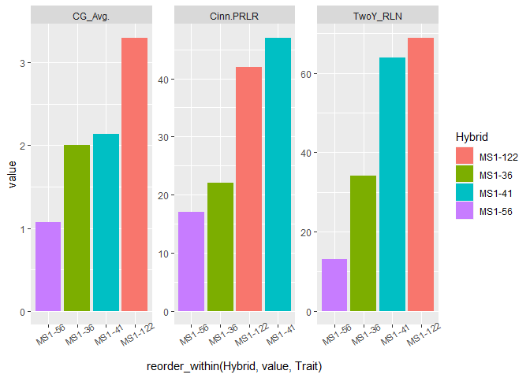
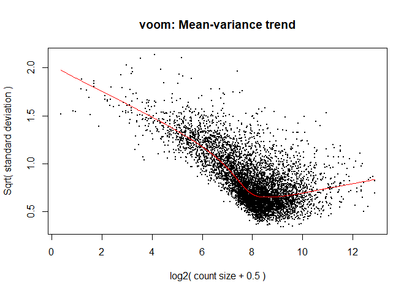
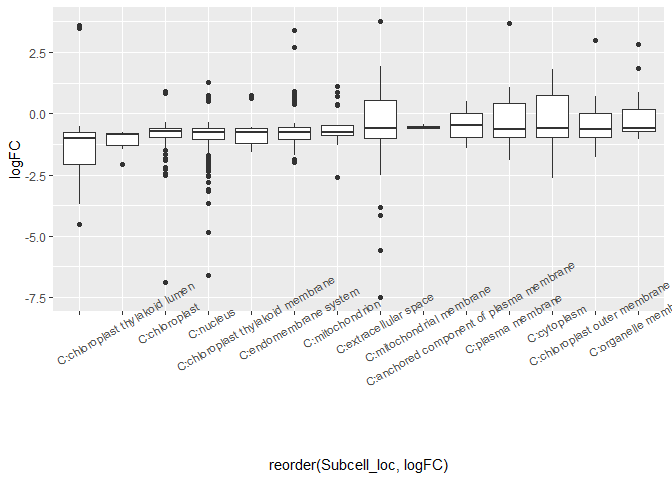

Jm3101\_v1.0\_and\_Walnut\_2.0\_ref\_MS1s\_only
================
Houston Saxe
1/28/2022

## Load neccessary libraries

``` r
pacman::p_load(data.table, ggplot2, ggfortify, stringr, rtracklayer, ape, GEOquery, Biobase, BiocManager, dplyr, statmod, tidytable, tibble, ggpubr, cowplot, tidyr, tidytext)
```

    ## Installing package into 'C:/Users/hsaxe/OneDrive/Documents/R/win-library/4.1'
    ## (as 'lib' is unspecified)

    ## also installing the dependency 'rlang'

    ## Warning: unable to access index for repository http://www.stats.ox.ac.uk/pub/RWin/bin/windows/contrib/4.1:
    ##   cannot open URL 'http://www.stats.ox.ac.uk/pub/RWin/bin/windows/contrib/4.1/PACKAGES'

    ## package 'rlang' successfully unpacked and MD5 sums checked

    ## Warning: cannot remove prior installation of package 'rlang'

    ## Warning in file.copy(savedcopy, lib, recursive = TRUE):
    ## problem copying C:\Users\hsaxe\OneDrive\Documents\R\win-
    ## library\4.1\00LOCK\rlang\libs\x64\rlang.dll to C:
    ## \Users\hsaxe\OneDrive\Documents\R\win-library\4.1\rlang\libs\x64\rlang.dll:
    ## Permission denied

    ## Warning: restored 'rlang'

    ## package 'tidytable' successfully unpacked and MD5 sums checked
    ## 
    ## The downloaded binary packages are in
    ##  C:\Users\hsaxe\AppData\Local\Temp\RtmpWChQip\downloaded_packages

    ## 
    ## tidytable installed

    ## Warning in pacman::p_load(data.table, ggplot2, ggfortify, stringr, rtracklayer, : Failed to install/load:
    ## tidytable

``` r
## Helpful function for quick viewing of wide data
left = function(x, n = 10){head(x[,1:n])}
```

# Prepare expression data

``` r
## Read in data
dat = fread("C:/Users/hsaxe/OneDrive/Documents/ALAB/Transcriptome_data/Root/SCRI_ROOT_RNAseq_counts_combined_genomes.txt")

dat$GeneID = gsub("LOC", "", dat$GeneID)

dat = dat %>% 
  select(contains(c('GeneID', 'MS1')))

head(dat)
```

    ##       GeneID MS1-122-1 MS1-122-2 MS1-122-3 MS1-122-4 MS1-122-5 MS1-122-6
    ## 1: 121242473        23        29        50        26        54        23
    ## 2: 121268866         0         0         0         0         0         0
    ## 3: 121241406       622       674       618       233       986       368
    ## 4: 121250192        80       123        91        52       176        70
    ## 5: 121241144        13        17        20        13        32        11
    ## 6: 121255391       181       181       253        69       259       162
    ##    MS1-36-1 MS1-36-2 MS1-36-3 MS1-36-4 MS1-36-5 MS1-36-6 MS1-41-1 MS1-41-2
    ## 1:       13       11       15       13       12       33        9       14
    ## 2:        0        0        0        0        0        0        0        0
    ## 3:      787      342     1020      531      491      714      535      231
    ## 4:      153       91      228      148      129      173      101       54
    ## 5:        3       15       20        3        1       17       10        2
    ## 6:      331       76      386      180       14      126      115       88
    ##    MS1-41-3 MS1-41-4 MS1-41-5 MS1-41-6 MS1-56-1 MS1-56-2 MS1-56-3 MS1-56-4
    ## 1:        9        7       17        7       35       21       25       10
    ## 2:        0        0        0        0        0        0        0        0
    ## 3:      454      355      618      331     1122     1017      846      828
    ## 4:       82       73      107       75      196      242      156      152
    ## 5:        7        9        2        6        1        1        1        2
    ## 6:      181      122      235      162       43       20       77       26
    ##    MS1-56-5 MS1-56-6
    ## 1:        0       30
    ## 2:        0        0
    ## 3:      155     1116
    ## 4:       46      247
    ## 5:        1        0
    ## 6:       11       15

# Read in metadata

``` r
metadata = fread("C:/Users/hsaxe/OneDrive/Documents/ALAB/Transcriptome_data/Root/R/Phenotyping/SCRI/LongList3_2Y.csv", stringsAsFactors = T)

head(metadata)
```

    ##    CAL:_Wip_ID...1 CG_Avg. CG_Dec. Cinn.PCLR Cinn.PRLR Pini.PCLR Pini.PRLR
    ## 1:            I8-1    2.40       D         7        30        81        25
    ## 2:            I9-2    2.30       D        22        21        63        14
    ## 3:           Vlach    3.40       K        72        79        59        39
    ## 4:           VX211    3.10       K        57        65        64        44
    ## 5:          29JM-4    3.10       D        24        17        68        31
    ## 6:          29JM-8    2.75       D        55        50        35        34
    ##                  PHY_Dec. TwoY_length TwoY_RLN NEM_Dec. Unity
    ## 1:                      D      124.50      5.0        D D-D-D
    ## 2:                      D      139.75     58.5        D D-D-D
    ## 3:                   SAVE      170.57    112.2        K K-K-K
    ## 4:                   SAVE      133.30     87.4        K K-K-K
    ## 5:                      D       70.10     14.8        D D-D-D
    ## 6: save due to in trials?       77.50     18.7        K D-K-K

# Modify metadata for this analysis

``` r
metadata = data.frame(Sample = colnames(dat)[colnames(dat) != 'GeneID']) %>%
  mutate(Hybrid = as.factor(gsub("\\-\\d$", "", Sample))) %>%
  left_join(metadata, by = c('Hybrid' = 'CAL:_Wip_ID...1'))
  
row.names(metadata) = metadata$Sample

head(metadata)
```

    ##              Sample  Hybrid CG_Avg. CG_Dec. Cinn.PCLR Cinn.PRLR Pini.PCLR
    ## MS1-122-1 MS1-122-1 MS1-122     3.3       D        49        42        50
    ## MS1-122-2 MS1-122-2 MS1-122     3.3       D        49        42        50
    ## MS1-122-3 MS1-122-3 MS1-122     3.3       D        49        42        50
    ## MS1-122-4 MS1-122-4 MS1-122     3.3       D        49        42        50
    ## MS1-122-5 MS1-122-5 MS1-122     3.3       D        49        42        50
    ## MS1-122-6 MS1-122-6 MS1-122     3.3       D        49        42        50
    ##           Pini.PRLR PHY_Dec. TwoY_length TwoY_RLN NEM_Dec. Unity
    ## MS1-122-1        18        D         173     68.9        K D-D-K
    ## MS1-122-2        18        D         173     68.9        K D-D-K
    ## MS1-122-3        18        D         173     68.9        K D-D-K
    ## MS1-122-4        18        D         173     68.9        K D-D-K
    ## MS1-122-5        18        D         173     68.9        K D-D-K
    ## MS1-122-6        18        D         173     68.9        K D-D-K

# Plotting metadata

``` r
metaLong = metadata %>% 
  select(!Sample) %>% 
  select(Hybrid, CG_Avg., Cinn.PRLR, TwoY_RLN) %>% 
  distinct() %>% 
  pivot_longer(where(is.numeric), names_to = 'Trait')

p =ggplot(metaLong, aes(reorder_within(Hybrid, value, Trait), value, fill = Hybrid))+
  geom_col()+
  scale_x_reordered()+
  theme(axis.text.x = element_text(angle = 30))+
  facet_wrap(~Trait, scales = 'free', ncol = 4)
p
```

<!-- -->

``` r
save_plot('results/metadata_plot.png', p, base_height = 4, base_width = 8)
```

# Center and scale predictors to make comparisons more interpretable in results

``` r
metadata_S = metadata %>%
  mutate_if(is.numeric, scale)
```

# Limma needs GeneIDs as rownames in expression data. Also, colnames of expression data need to match rownames of metadata

``` r
dat1 = dat %>%
  column_to_rownames(var =  "GeneID") %>%
  as.matrix()

## Do colnames in data match rownames in metadata? If they don't, use match(x,y) produces the order of y required to match the order of x

all(colnames(dat1) == rownames(metadata_S))
```

    ## [1] TRUE

``` r
# Names match

# If they didn't match, use below code
## What order do rows of metadat need to be in to match colnames of dat1?
# match(colnames(dat1), rownames(metadata))

## Reset rownames
# metadata = metadata[match(colnames(dat1), rownames(metadata)),]

# all(colnames(dat1) == rownames(metadata))
# now they match
```

# Microcarpa annotation

``` r
annotation_Jm = fread("C:/Users/hsaxe/OneDrive/Documents/ALAB/Genome_info/Genomic_Annotation_2/Jm_x_Jr/Jm_x_Jr_Genomic_annotation_12_16_2021.csv")

## Extract everything but class mRNA and other isoforms. This reduces duplication in the data
annotation_Jm = annotation_Jm %>%
  filter(feature != "mRNA", !grepl('\\sX[2-9]$|\\sX1[0-9]$', name)) %>%
  mutate(GeneID = as.character(GeneID)) %>% 
  mutate(Parent_haplotype = "J.microcarpa")

head(annotation_Jm)
```

    ##    feature        class chromosome  start    end
    ## 1:   ncRNA       lncRNA         1D      7   1181
    ## 2:   ncRNA       lncRNA         1D  14257  15054
    ## 3:     CDS with_protein         1D  27395  59712
    ## 4:     CDS with_protein         1D  85492 108529
    ## 5:     CDS with_protein         1D 137771 144108
    ## 6:     CDS with_protein         1D 164081 167500
    ##                                                         name    GeneID
    ## 1:                              uncharacterized LOC121242473 121242473
    ## 2:                              uncharacterized LOC121268866 121268866
    ## 3: LOW QUALITY PROTEIN: uncharacterized protein LOC121241406 121241406
    ## 4:          membrane-bound O-acyltransferase gup1 isoform X1 121250192
    ## 5:                  pectin acetylesterase 12-like isoform X1 121241144
    ## 6:                                  titin homolog isoform X1 121255391
    ##    product_accession Jr-GeneID Jr-chromosome           Subcell_loc Score
    ## 1:    XR_005935900.1        NA                                        NA
    ## 2:    XR_005941271.1        NA                                        NA
    ## 3:    XP_040995100.1 108981175             7             C:nucleus  1.00
    ## 4:    XP_041005135.1 108980963             7 C:endomembrane system  0.92
    ## 5:    XP_040994724.1 108980844             7 C:extracellular space  0.77
    ## 6:    XP_041011626.1 109018740             7             C:nucleus  1.00
    ##    Parent_haplotype
    ## 1:     J.microcarpa
    ## 2:     J.microcarpa
    ## 3:     J.microcarpa
    ## 4:     J.microcarpa
    ## 5:     J.microcarpa
    ## 6:     J.microcarpa

# Regia annotation

``` r
annotation_Jr = fread("C:/Users/hsaxe/OneDrive/Documents/ALAB/Genome_info/Genomic_Annotation_2/Jr/Jr_Genomic_annotation_1_21_2022.csv")

## Extract everything but class mRNA and other isoforms. This reduces duplication in the data
annotation_Jr = annotation_Jr %>%
  filter(feature != "mRNA", !grepl('\\sX[2-9]$|\\sX1[0-9]$', name)) %>%
  mutate(GeneID = as.character(GeneID)) %>% 
  mutate(Parent_haplotype = "J.regia")

head(annotation_Jr)
```

    ##    feature        class chromosome start
    ## 1:     CDS with_protein          1     6
    ## 2:     CDS with_protein          1  7068
    ## 3:     CDS with_protein          1 18754
    ## 4:     CDS with_protein          1 18754
    ## 5:     CDS with_protein          1 18754
    ## 6:     CDS with_protein          1 18754
    ##                                                 name    GeneID
    ## 1:             auxin efflux carrier component 2-like 118344036
    ## 2:             probable WRKY transcription factor 17 118348327
    ## 3: KH domain-containing protein HEN4-like isoform X1 108990460
    ## 4: KH domain-containing protein HEN4-like isoform X1 108990460
    ## 5: KH domain-containing protein HEN4-like isoform X1 108990460
    ## 6: KH domain-containing protein HEN4-like isoform X1 108990460
    ##    product_accession           Subcell_loc Score Parent_haplotype
    ## 1:    XP_035539669.1 C:endomembrane system  0.78          J.regia
    ## 2:    XP_035545773.1             C:nucleus  1.00          J.regia
    ## 3:    XP_018819971.1             C:nucleus  1.00          J.regia
    ## 4:    XP_018819972.1             C:nucleus  1.00          J.regia
    ## 5:    XP_035550599.1             C:nucleus  1.00          J.regia
    ## 6:    XP_035550603.1             C:nucleus  1.00          J.regia

# Combine Jm and Jr annotations

``` r
annotation_combined = annotation_Jm %>%
  rbind(annotation_Jr, fill = T)

fwrite(annotation_combined, 'results/annotation_combined.csv')
```

# Create DGEList object

``` r
library(edgeR)
```

    ## Loading required package: limma

    ## 
    ## Attaching package: 'limma'

    ## The following object is masked from 'package:BiocGenerics':
    ## 
    ##     plotMA

``` r
dds = DGEList(dat1)

dim(dds$counts)
```

    ## [1] 67924    24

``` r
## Calculate library normalization factors (does not do anything to data)
dds = calcNormFactors(dds)

## These are the size factors (normalization factors) for each sample
# dds$samples
```

# Filter by max CPM of 75 (This is used for DGE analysis)

``` r
drop = which(apply(cpm(dds), 1, max) < 75)

d = dds[-drop,]

dim(d) # number of genes left
```

    ## [1] 6455   24

``` r
## CPM normalized counts of all data
cpm = cpm(dds, prior.count = 2, log = F) 

## CPM normalized counts of filtered data
cpmd = cpm[-drop,]
```

# Less conservative threshold for looking at expressed genes

``` r
drop = which(apply(cpm(dds), 1, mean) < 20)

d2 = dds[-drop,]

dim(d2) # number of genes left
```

    ## [1] 13312    24

``` r
fwrite(as.data.frame(d2$counts), 'results/CPM_20_filtered.csv', row.names = T)

## CPM normalized counts of all data
cpm = cpm(d2, prior.count = 2, log = F) 

## CPM normalized counts of filtered data
cpmd20 = cpm[-drop,]
```

## Cluster visualization

``` r
## MDS visualization
# plotMDS(d, col = as.numeric(metadata$Hybrid), cex=1)
```

# Make function for PCA analysis/plotting

``` r
plot_pca = function(dat, metadata, sample_colname = 'Group', sample_names_in = 'row_names', x = 'PC1', y = 'PC2', scale = T, center = T, color = 'Group', fill = 'Group', plot_type = '2D', group_by = 'Group', summarise_for_scatter = T) {
  
  if(sample_names_in == 'col_names') {
    dat = t(dat) %>%
      as.data.frame() %>%
    mutate(across(everything(), as.numeric)) %>%
    scale(scale = scale, center = center) %>%
    as.matrix()
  } else {
    dat = dat %>%
    as.data.frame() %>% 
    column_to_rownames(var = group) %>% 
    select_if(is.character) %>%
    mutate(across(everything(), as.numeric)) %>%
    scale(scale = scale, center = center) %>%
    as.matrix()
  }
  
  dat = prcomp(dat, scale = F, center = F)
  
  scores = dat$x
  
  eigs = dat$sdev^2 
  
  var_exp = paste('(', formatC((eigs/sum(eigs))*100, format = 'f', digits = 2), '%', ')', sep = '')

  names(var_exp) = colnames(scores)
  
  plot_dat = scores %>%
  data.frame() %>%
  rownames_to_column(var = sample_colname) %>%
  left_join(metadata)
 
  if(plot_type == '2D') {
  p = ggplot(plot_dat, aes(get(x), get(y), color = get(color), group = get(group_by), fill = get(fill)))+
  geom_point()+
  stat_ellipse(geom = 'polygon', alpha = 0.5, level = 0.65)+
    # ggforce::geom_mark_ellipse(aes(fill = get(fill), label = get(group_by)))+
  geom_text(aes(label = get(group_by)), color = 'black', size = 2.5)+
  labs(x = paste(x, var_exp[x]), y = paste(y, var_exp[y]), fill = color, color = color)
  return(p)
  } 
  
  if(plot_type == 'boxplot') {
    p = ggplot(plot_dat, aes(reorder(get(color), get(x)), get(x), fill = get(color)))+
    geom_boxplot()+
    labs(x = color, y = paste(x, var_exp[x]), fill = color)
    return(p)
  }
  
  if(plot_type == 'scatter') {
    if(summarise_for_scatter == T) {
      
      plot_dat = plot_dat %>%
      group_by(get(group_by)) %>%
      summarise_if(is.numeric, mean)  
  
  colnames(plot_dat)[1] = group_by
  
  ggscatter(plot_dat, x = x, y = y, add = 'reg.line', color = color)+
      stat_cor(label.x = 0, label.y = max(plot_dat[y])*1.1)+ 
      stat_smooth(method = 'lm')+
      labs(x = paste(x, var_exp[x]))
      
    } else {
      ggscatter(plot_dat, x = x, y = y, add = 'reg.line', color = color)+
      stat_cor(label.x = 0, label.y = max(plot_dat[y])*1.1)+ 
      stat_smooth(method = 'lm')+
      labs(x = paste(x, var_exp[x]))
    }
    
  }
  
}
```

# Plot PCA to look in R

``` r
plot_pca(cpmd, metadata, sample_colname = 'Sample', sample_names_in = 'col_names', x = 'PC1', y = 'PC2', scale = T, center = T, color = 'Hybrid', fill = 'Hybrid', plot_type = '2D', group_by = 'Hybrid')
```

    ## Joining, by = "Sample"

<!-- -->

# Plot PCA to save

``` r
# a = plot_pca(cpmd, metadata, sample_colname = 'Sample', sample_names_in = 'col_names', x = 'PC1', y = 'PC2', scale = T, center = T, color = 'CG_Avg.', fill = 'CG_Avg.', plot_type = '2D', group_by = 'Hybrid')
# 
# b = plot_pca(cpmd, metadata, sample_colname = 'Sample', sample_names_in = 'col_names', x = 'PC1', y = 'PC2', scale = T, center = T, color = 'Cinn.PRLR', fill = 'Cinn.PRLR', plot_type = '2D', group_by = 'Hybrid')
#           
# c = plot_pca(cpmd, metadata, sample_colname = 'Sample', sample_names_in = 'col_names', x = 'PC1', y = 'PC2', scale = T, center = T, color = 'TwoY_RLN', fill = 'TwoY_RLN', plot_type = '2D', group_by = 'Hybrid')
# 
# 
# save_plot('PCA_Hybrids.png', ggarrange(a, b, c, labels = c('A', 'B', 'C'), ncol = 3), base_height = 3, base_width = 12)
```

# PCA boxplot

``` r
# plot_pca(cpmd, metadata, sample_colname = 'Sample', sample_names_in = 'col_names', x = 'PC2', y = 'PC2', scale = T, center = T, color = 'Cinn.PRLR', plot_type = 'boxplot')
```

# PCA scatterplot with fitted line and correlation coefficient

``` r
## Available plotting data: [1] "Hybrid"      "Sample"      "CG_Avg."     "CG_Dec."     "Cinn.PCLR"   "Cinn.PRLR"  
 # [7] "Pini.PCLR"   "Pini.PRLR"   "PHY_Dec."    "TwoY_length" "TwoY_RLN"    "NEM_Dec."   
# [13] "Unity"
a = plot_pca(cpmd, metadata, sample_colname = 'Sample', sample_names_in = 'col_names', x = 'PC1', y = 'CG_Avg.', scale = T, center = T, color = 'Hybrid', plot_type = 'scatter', group_by = 'Hybrid', summarise_for_scatter = T)+
  ggtitle('Trait: Crown Gall Disease')
```

    ## Joining, by = "Sample"

``` r
b = plot_pca(cpmd, metadata, sample_colname = 'Sample', sample_names_in = 'col_names', x = 'PC1', y = 'Cinn.PRLR', scale = T, center = T, color = 'Hybrid', plot_type = 'scatter', group_by = 'Hybrid', summarise_for_scatter = T)+
  ggtitle('Trait: Phytophthora Root Rot')
```

    ## Joining, by = "Sample"

``` r
c = plot_pca(cpmd, metadata, sample_colname = 'Sample', sample_names_in = 'col_names', x = 'PC1', y = 'TwoY_RLN', scale = T, center = T, color = 'Hybrid', plot_type = 'scatter', group_by = 'Hybrid', summarise_for_scatter = T)+
  ggtitle('Trait: Nematode Count')
```

    ## Joining, by = "Sample"

``` r
ggarrange(a, b, c, labels = c('A', 'B', 'C'), ncol = 1)
```

    ## `geom_smooth()` using formula 'y ~ x'

    ## `geom_smooth()` using formula 'y ~ x'
    ## `geom_smooth()` using formula 'y ~ x'
    ## `geom_smooth()` using formula 'y ~ x'
    ## `geom_smooth()` using formula 'y ~ x'
    ## `geom_smooth()` using formula 'y ~ x'

<!-- -->

``` r
save_plot('results/Scatterplot_PC1_CG_PH_NEM.png', ggarrange(a, b, c, labels = c('A', 'B', 'C'), ncol = 1), base_height = 10, base_width = 6)
```

    ## `geom_smooth()` using formula 'y ~ x'
    ## `geom_smooth()` using formula 'y ~ x'
    ## `geom_smooth()` using formula 'y ~ x'
    ## `geom_smooth()` using formula 'y ~ x'
    ## `geom_smooth()` using formula 'y ~ x'
    ## `geom_smooth()` using formula 'y ~ x'

# Heatmap

``` r
# library(pheatmap)
# 
# cor = cor(cpmd)
# 
# pheatmap(cor, annotation = select(metadata,Hybrid))
```

# Create design matrix for CG score

``` r
mm = model.matrix(~CG_Avg., data = metadata_S)

head(mm)
```

    ##           (Intercept)  CG_Avg.
    ## MS1-122-1           1 1.452745
    ## MS1-122-2           1 1.452745
    ## MS1-122-3           1 1.452745
    ## MS1-122-4           1 1.452745
    ## MS1-122-5           1 1.452745
    ## MS1-122-6           1 1.452745

## What is voom?

## 1. Counts are transformed to log2 counts per million reads (CPM), where “per million reads” is defined based on the normalization factors we calculated earlier.

## 2. A linear model is fitted to the log2 CPM for each gene, and the residuals are calculated.

## 3. A smoothed curve is fitted to the sqrt(residual standard deviation) by average expression.

## (see red line in plot below)

## 4. The smoothed curve is used to obtain weights for each gene and sample that are passed into limma along with the log2 CPMs.

## More details at “[voom: precision weights unlock linear model analysis tools for RNA-seq read counts](https://genomebiology.biomedcentral.com/articles/10.1186/gb-2014-15-2-r29)”

# Filtered mean-variance trend

``` r
y <- voom(d, mm, plot = T)
```

<!-- -->

# Vs Unfiltered mean-variance trend

``` r
# tmp <- voom(dds, mm, plot = T)
```

# Fitting linear models in limma with random effects

``` r
## Need to tell limma where the within class correlation is coming from
dupcor_CG = duplicateCorrelation(y, mm, block = metadata$Hybrid)

## How correlated are the hybrid replicates on average?
consensus.corr.CG = dupcor_CG$consensus.correlation

consensus.corr.CG
```

    ## [1] 0.434176

``` r
# lmFit fits a linear model using weighted least squares for each gene:
fit = lmFit(y, design = mm, block = metadata$Hybrid, correlation = consensus.corr.CG) 
```

## The variance characteristics of low expressed genes are different from high expressed genes, if treated the same, the effect is to over represent low expressed genes in the DE list. This is corrected for by the log transformation and voom. However, some genes will have increased or decreased variance that is not a result of low expression, but due to other random factors. We are going to run empirical Bayes to adjust the variance of these genes.

## Empirical Bayes smoothing of standard errors (shifts standard errors that are much larger or smaller than those from other genes towards the average standard error) (see “[Linear Models and Empirical Bayes Methods for Assessing Differential Expression in Microarray Experiments](https://www.degruyter.com/doi/10.2202/1544-6115.1027)”

``` r
BlockFit_CG = eBayes(fit)
```

# Limma results

``` r
res_summaries_CG = BlockFit_CG %>% decideTests() %>% summary()

res_summaries_CG
```

    ##        (Intercept) CG_Avg.
    ## Down             1    1945
    ## NotSig         115    3785
    ## Up            6339     725

# Table of results

``` r
impCG = topTable(BlockFit_CG, sort.by = "logFC", p.value = 0.05, adjust.method = "BH", number = Inf) %>%
  mutate(R = sqrt(t^2/(t^2 + 40)), AveExpr = 2^AveExpr)
```

    ## Removing intercept from test coefficients

``` r
dim(impCG)
```

    ## [1] 2670    7

``` r
## adding Hybrid as a blocking variable reduced DEGs by several thousand
```

# PCA of CG DEGs

``` r
ids = impCG %>% 
  rownames_to_column(var = 'GeneID') %>% 
  select(GeneID)

PCA_CG = cpmd %>% 
  as.data.frame() %>% 
  rownames_to_column(var = 'GeneID') %>% 
  right_join(ids) %>% 
  column_to_rownames(var = 'GeneID')
```

    ## Joining, by = "GeneID"

``` r
plot_pca(PCA_CG, metadata, sample_colname = 'Sample', sample_names_in = 'col_names', x = 'PC1', y = 'PC2', scale = T, center = T, color = 'CG_Avg.', fill = 'CG_Avg.', plot_type = '2D', group_by = 'Hybrid')
```

    ## Joining, by = "Sample"

<!-- -->

# Merge annotation with results

``` r
impCG = impCG %>%
  rownames_to_column(var = "GeneID") %>%
  left_join(annotation_combined, by = "GeneID")

head(impCG)
```

    ##      GeneID     logFC    AveExpr         t      P.Value    adj.P.Val        B
    ## 1 109016198 -6.542261  1.8501302 -6.505399 6.199358e-07 1.215702e-04 5.430395
    ## 2 109017709 -5.686888  5.0164589 -6.917797 2.180009e-07 7.406292e-05 6.725269
    ## 3 109004718 -5.442998  9.3770746 -5.749991 4.397483e-06 2.689897e-04 4.258588
    ## 4 109021176 -5.244791  0.6362362 -7.030110 1.645567e-07 6.638836e-05 5.591110
    ## 5 109022106 -4.892365  0.9183470 -4.974968 3.423363e-05 7.015177e-04 1.879880
    ## 6 121237960 -4.883703 16.1279239 -7.332406 7.777680e-08 4.183744e-05 8.099022
    ##           R feature        class chromosome    start      end
    ## 1 0.7170025     CDS with_protein          8 25240305       NA
    ## 2 0.7380441     CDS with_protein         15  5713036       NA
    ## 3 0.6726981     CDS with_protein          7 17915184       NA
    ## 4 0.7434279     CDS with_protein         11 30074105       NA
    ## 5 0.6182575     CDS with_protein         10  8877504       NA
    ## 6 0.7572304     CDS with_protein         1D 17558112 17559107
    ##                                               name product_accession Jr-GeneID
    ## 1                               dehydrin DHN1-like    XP_035549466.1        NA
    ## 2             uncharacterized protein LOC109017709    XP_035541988.1        NA
    ## 3         late embryogenesis abundant protein D-29    XP_018838898.2        NA
    ## 4 E3 ubiquitin-protein ligase UPL1-like isoform X1    XP_018859300.1        NA
    ## 5                        cytochrome P450 78A7-like    XP_018860457.1        NA
    ## 6    late embryogenesis abundant protein D-29-like    XP_040990832.1 109004718
    ##   Jr-chromosome           Subcell_loc Score Parent_haplotype
    ## 1          <NA>             C:nucleus  1.00          J.regia
    ## 2          <NA>             C:nucleus  1.00          J.regia
    ## 3          <NA> C:extracellular space  0.82          J.regia
    ## 4          <NA> C:extracellular space  0.60          J.regia
    ## 5          <NA> C:endomembrane system  0.78          J.regia
    ## 6             7 C:extracellular space  0.80     J.microcarpa

``` r
length(unique(impCG$GeneID))
```

    ## [1] 2670

``` r
fwrite(impCG, 'results/Limma_results_table_CG.csv')
```

# Read in CG results

``` r
impCG = fread('results/Limma_results_table_CG.csv')
```

# Positive CG DEGs for GO

``` r
CG_GO_pos_Jm = impCG %>%
  filter(logFC > 0) %>%
  distinct(GeneID, Parent_haplotype, `Jr-GeneID`) %>%
  filter(Parent_haplotype == "J.microcarpa") %>%
  select(`Jr-GeneID`) %>%
  mutate(`Jr-GeneID` = paste0("LOC", `Jr-GeneID`)) %>% 
  rename(GeneID = `Jr-GeneID`)

length(unique(CG_GO_pos_Jm$GeneID))
```

    ## [1] 317

``` r
CG_GO_pos_both = impCG %>% 
  filter(logFC > 0) %>%
  distinct(GeneID, Parent_haplotype) %>%
  filter(Parent_haplotype == "J.regia") %>% 
  select(GeneID) %>%
  mutate(GeneID = paste0("LOC", GeneID)) %>% 
  rbind(CG_GO_pos_Jm)

length(unique(CG_GO_pos_both$GeneID))
```

    ## [1] 530

``` r
head(CG_GO_pos_both)
```

    ##          GeneID
    ## 1: LOC108987644
    ## 2: LOC108985473
    ## 3: LOC109002793
    ## 4: LOC108989061
    ## 5: LOC109006610
    ## 6: LOC109018703

``` r
fwrite(CG_GO_pos_both, "results/CG_DEGs_pos_GO.csv")
```

# Expression from alleles is causing duplication in GO results which means data loss as GO removes duplicates. However, these are not true duplicates.

# Maybe analyze separately and try to recombine?

``` r
# CG_GO_pos_Jm = impCG %>%
#   filter(logFC > 0) %>%
#   distinct(GeneID, Parent_haplotype, `Jr-GeneID`) %>%
#   filter(Parent_haplotype == "J.microcarpa") %>%
#   select(`Jr-GeneID`) %>%
#   mutate(`Jr-GeneID` = paste0("LOC", `Jr-GeneID`)) %>% 
#   rename(GeneID = `Jr-GeneID`)
# 
# 
# 
# CG_GO_pos_Jr= impCG %>% 
#   filter(logFC > 0) %>%
#   distinct(GeneID, Parent_haplotype) %>%
#   filter(Parent_haplotype == "J.regia") %>% 
#   select(GeneID) %>%
#   mutate(GeneID = paste0("LOC", GeneID))
# 
# length(unique(CG_GO_pos_Jr$GeneID)) + length(unique(CG_GO_pos_Jm$GeneID))
# 
# fwrite(CG_GO_pos_Jm, 'GO_test_CG_pos_Jm.csv')
# 
# 
# fwrite(CG_GO_pos_Jr, 'GO_test_CG_pos_Jr.csv')
```

# Negative CG DEGs for GO

``` r
CG_GO_neg_Jm = impCG %>%
  filter(logFC < 0) %>%
  distinct(GeneID, Parent_haplotype, `Jr-GeneID`) %>%
  filter(Parent_haplotype == "J.microcarpa") %>%
  select(`Jr-GeneID`) %>%
  mutate(`Jr-GeneID` = paste0("LOC", `Jr-GeneID`)) %>% 
  rename(GeneID = `Jr-GeneID`)

length(unique(CG_GO_neg_Jm$GeneID))
```

    ## [1] 962

``` r
CG_GO_neg_both = impCG %>% 
  filter(logFC < 0) %>%
  distinct(GeneID, Parent_haplotype) %>%
  filter(Parent_haplotype == "J.regia") %>% 
  select(GeneID) %>%
  mutate(GeneID = paste0("LOC", GeneID)) %>% 
  rbind(CG_GO_neg_Jm)

length(unique(CG_GO_neg_both$GeneID))
```

    ## [1] 1415

``` r
head(CG_GO_neg_both)
```

    ##          GeneID
    ## 1: LOC109016198
    ## 2: LOC109017709
    ## 3: LOC109004718
    ## 4: LOC109021176
    ## 5: LOC109022106
    ## 6: LOC118349596

``` r
fwrite(CG_GO_neg_both, "results/CG_DEGs_neg_GO.csv")
```

# Expression from alleles is causing duplication in GO results which means data loss as GO removes duplicates. However, these are not true duplicates.

``` r
# dups_neg_Jm = impCG %>%
#   filter(logFC < 0) %>%
#   distinct(GeneID, Parent_haplotype, `Jr-GeneID`) %>%
#   filter(Parent_haplotype == "J.microcarpa") %>%
#   select(`Jr-GeneID`, Parent_haplotype) %>%
#   rename(GeneID = `Jr-GeneID`)
# 
# dups_neg_both = impCG %>% 
#   filter(logFC < 0) %>%
#   distinct(GeneID, Parent_haplotype) %>%
#   filter(Parent_haplotype == "J.regia") %>% 
#   select(GeneID, Parent_haplotype) %>% 
#   rbind(dups_neg_Jm)
```

# Maybe analyze separately and try to recombine?

``` r
# CG_GO_neg_Jm = impCG %>%
#   filter(logFC < 0) %>%
#   distinct(GeneID, Parent_haplotype, `Jr-GeneID`) %>%
#   filter(Parent_haplotype == "J.microcarpa") %>%
#   select(`Jr-GeneID`) %>%
#   mutate(`Jr-GeneID` = paste0("LOC", `Jr-GeneID`)) %>% 
#   rename(GeneID = `Jr-GeneID`)
# 
# 
# 
# CG_GO_neg_Jr= impCG %>% 
#   filter(logFC < 0) %>%
#   distinct(GeneID, Parent_haplotype) %>%
#   filter(Parent_haplotype == "J.regia") %>% 
#   select(GeneID) %>%
#   mutate(GeneID = paste0("LOC", GeneID))
# 
# length(unique(CG_GO_neg_Jr$GeneID)) + length(unique(CG_GO_neg_Jm$GeneID))
# 
# fwrite(CG_GO_neg_Jm, 'GO_test_CG_neg_Jm.csv')
# 
# 
# fwrite(CG_GO_neg_Jr, 'GO_test_CG_neg_Jr.csv')
```

# CG Subcellular localization by logFC boxplot

``` r
subcell_CG = impCG %>% 
  distinct(GeneID, logFC, Subcell_loc, Parent_haplotype)

ggplot(subcell_CG, aes(reorder(Subcell_loc, logFC), logFC))+
  geom_boxplot()+
  theme(axis.text.x = element_text(angle = 30))
```

<!-- -->

# Fit model for genes associated with PHY score

``` r
mm = model.matrix(~Cinn.PRLR, data = metadata_S)

head(mm)
```

    ##           (Intercept) Cinn.PRLR
    ## MS1-122-1           1 0.7679476
    ## MS1-122-2           1 0.7679476
    ## MS1-122-3           1 0.7679476
    ## MS1-122-4           1 0.7679476
    ## MS1-122-5           1 0.7679476
    ## MS1-122-6           1 0.7679476

# Filtered mean-variance trend

``` r
y <- voom(d, mm, plot = T)
```

<!-- -->

# Fitting linear models in limma with random effects

``` r
## Need to tell limma where the within class correlation is coming from
dupcor_PHY = duplicateCorrelation(y, mm, block = metadata$Hybrid)

## How correlated are the hybrid replicates on average?
consensus.corr.PHY = dupcor_PHY$consensus.correlation

consensus.corr.PHY
```

    ## [1] 0.5669524

``` r
# lmFit fits a linear model using weighted least squares for each gene:
fit = lmFit(y, design = mm, block = metadata$Hybrid, correlation = consensus.corr.PHY) 

# Ebayes
BlockFit_PHY = eBayes(fit)
```

# Limma results

``` r
res_summaries_PHY = BlockFit_PHY %>% decideTests() %>% summary()

res_summaries_PHY
```

    ##        (Intercept) Cinn.PRLR
    ## Down             0       870
    ## NotSig         175      5477
    ## Up            6280       108

# Table of results

``` r
impPHY = topTable(BlockFit_PHY, sort.by = "logFC", p.value = 0.05, adjust.method = "BH", number = Inf) %>%
  mutate(R = sqrt(t^2/(t^2 + 40)), AveExpr = 2^AveExpr)
```

    ## Removing intercept from test coefficients

``` r
dim(impPHY)
```

    ## [1] 978   7

``` r
## adding Hybrid as a blocking variable reduced DEGs by several thousand

head(impPHY)
```

    ##               logFC   AveExpr         t      P.Value  adj.P.Val          B
    ## 109004718 -7.504556  9.377075 -3.161211 3.902295e-03 0.03917467 -1.9478293
    ## 121249183 -6.874128  6.595917 -3.163075 3.884270e-03 0.03911682 -2.0544315
    ## 109016198 -6.606870  1.850130 -2.989328 5.957926e-03 0.04475293 -2.7279124
    ## 121268603 -5.571834 11.529381 -2.937189 6.762960e-03 0.04786722 -2.3316091
    ## 121251444 -4.847617  4.097486 -4.654596 7.980904e-05 0.01144816  0.2427923
    ## 108984104 -4.496372 61.234832 -3.572894 1.376890e-03 0.02719727 -1.0099440
    ##                   R
    ## 109004718 0.4470929
    ## 121249183 0.4473038
    ## 109016198 0.4273256
    ## 121268603 0.4212043
    ## 121251444 0.5927366
    ## 108984104 0.4918637

# Merge annotation with results

``` r
impPHY = impPHY %>%
  rownames_to_column(var = "GeneID") %>%
  left_join(annotation_combined, by = "GeneID")

head(impPHY)
```

    ##      GeneID     logFC   AveExpr         t      P.Value  adj.P.Val          B
    ## 1 109004718 -7.504556  9.377075 -3.161211 3.902295e-03 0.03917467 -1.9478293
    ## 2 121249183 -6.874128  6.595917 -3.163075 3.884270e-03 0.03911682 -2.0544315
    ## 3 109016198 -6.606870  1.850130 -2.989328 5.957926e-03 0.04475293 -2.7279124
    ## 4 121268603 -5.571834 11.529381 -2.937189 6.762960e-03 0.04786722 -2.3316091
    ## 5 121251444 -4.847617  4.097486 -4.654596 7.980904e-05 0.01144816  0.2427923
    ## 6 108984104 -4.496372 61.234832 -3.572894 1.376890e-03 0.02719727 -1.0099440
    ##           R feature        class chromosome    start     end
    ## 1 0.4470929     CDS with_protein          7 17915184      NA
    ## 2 0.4473038     CDS with_protein         2D   325909  326637
    ## 3 0.4273256     CDS with_protein          8 25240305      NA
    ## 4 0.4212043     CDS with_protein         5S  8096066 8096422
    ## 5 0.5927366     CDS with_protein         2S  5610154 5611522
    ## 6 0.4918637   ncRNA       lncRNA          1  2406665      NA
    ##                                              name product_accession Jr-GeneID
    ## 1        late embryogenesis abundant protein D-29    XP_018838898.2        NA
    ## 2        light-regulated protein 1, chloroplastic    XP_041003832.1 109001297
    ## 3                              dehydrin DHN1-like    XP_035549466.1        NA
    ## 4            uncharacterized protein LOC121268603    XP_041028861.1 108993380
    ## 5 uncharacterized protein LOC121251444 isoform X1    XP_041006639.1 109007630
    ## 6                    uncharacterized LOC108984104    XR_001994969.2        NA
    ##   Jr-chromosome           Subcell_loc Score Parent_haplotype
    ## 1          <NA> C:extracellular space  0.82          J.regia
    ## 2             1         C:chloroplast  1.00     J.microcarpa
    ## 3          <NA>             C:nucleus  1.00          J.regia
    ## 4             4 C:extracellular space  0.70     J.microcarpa
    ## 5            10             C:nucleus  1.00     J.microcarpa
    ## 6          <NA>                          NA          J.regia

``` r
fwrite(impPHY, 'results/Limma_results_table_PHY.csv')

impPHY = fread('results/Limma_results_table_PHY.csv')
```

# Read in PHY results

``` r
impPHY = fread('results/Limma_results_table_PHY.csv')
```

# Positive PHY DEGs for GO

``` r
PHY_GO_pos_Jm = impPHY %>%
  filter(logFC > 0) %>%
  distinct(GeneID, Parent_haplotype, `Jr-GeneID`) %>%
  filter(Parent_haplotype == "J.microcarpa") %>%
  select(`Jr-GeneID`) %>%
  mutate(`Jr-GeneID` = paste0("LOC", `Jr-GeneID`)) %>% 
  rename(GeneID = `Jr-GeneID`)

length(unique(PHY_GO_pos_Jm$GeneID))
```

    ## [1] 52

``` r
PHY_GO_pos_both = impPHY %>% 
  filter(logFC > 0) %>%
  distinct(GeneID, Parent_haplotype) %>%
  filter(Parent_haplotype == "J.regia") %>% 
  select(GeneID) %>%
  mutate(GeneID = paste0("LOC", GeneID)) %>% 
  rbind(PHY_GO_pos_Jm)

length(unique(PHY_GO_pos_both$GeneID))
```

    ## [1] 91

``` r
head(PHY_GO_pos_both)
```

    ##          GeneID
    ## 1: LOC109008986
    ## 2: LOC108985005
    ## 3: LOC108992399
    ## 4: LOC109006717
    ## 5: LOC108997033
    ## 6: LOC109020737

``` r
fwrite(PHY_GO_pos_both, "results/PHY_DEGs_pos_GO.csv")
```

# Negative PHY DEGs for GO

``` r
PHY_GO_neg_Jm = impPHY %>%
  filter(logFC < 0) %>%
  distinct(GeneID, Parent_haplotype, `Jr-GeneID`) %>%
  filter(Parent_haplotype == "J.microcarpa") %>%
  select(`Jr-GeneID`) %>%
  mutate(`Jr-GeneID` = paste0("LOC", `Jr-GeneID`)) %>% 
  rename(GeneID = `Jr-GeneID`)

length(unique(PHY_GO_neg_Jm$GeneID))
```

    ## [1] 455

``` r
PHY_GO_neg_both = impPHY %>% 
  filter(logFC < 0) %>%
  distinct(GeneID, Parent_haplotype) %>%
  filter(Parent_haplotype == "J.regia") %>% 
  select(GeneID) %>%
  mutate(GeneID = paste0("LOC", GeneID)) %>% 
  rbind(PHY_GO_neg_Jm)

length(unique(PHY_GO_neg_both$GeneID))
```

    ## [1] 698

``` r
head(PHY_GO_neg_both)
```

    ##          GeneID
    ## 1: LOC109004718
    ## 2: LOC109016198
    ## 3: LOC108984104
    ## 4: LOC118345731
    ## 5: LOC109021176
    ## 6: LOC108998169

``` r
fwrite(PHY_GO_neg_both, "results/PHY_DEGs_neg_GO.csv")
```

# PHY Subcellular localization by logFC boxplot

``` r
subcell_PHY = impPHY %>% 
  distinct(GeneID, logFC, Subcell_loc, Parent_haplotype)

ggplot(subcell_PHY, aes(reorder(Subcell_loc, logFC), logFC))+
  geom_boxplot()+
  theme(axis.text.x = element_text(angle = 30))
```

<!-- -->

# Fit model for genes associated with NEM score

``` r
mm = model.matrix(~TwoY_RLN, data = metadata_S)

head(mm)
```

    ##           (Intercept) TwoY_RLN
    ## MS1-122-1           1 1.029263
    ## MS1-122-2           1 1.029263
    ## MS1-122-3           1 1.029263
    ## MS1-122-4           1 1.029263
    ## MS1-122-5           1 1.029263
    ## MS1-122-6           1 1.029263

# Filtered mean-variance trend

``` r
y <- voom(d, mm, plot = T)
```

<!-- -->

# Fitting linear models in limma with random effects

``` r
## Need to tell limma where the within class correlation is coming from
dupcor_NEM = duplicateCorrelation(y, mm, block = metadata$Hybrid)

## How correlated are the hybrid replicates on average?
consensus.corr.NEM = dupcor_NEM$consensus.correlation

consensus.corr.NEM
```

    ## [1] 0.4381766

``` r
# lmFit fits a linear model using weighted least squares for each gene:
fit = lmFit(y, design = mm, block = metadata$Hybrid, correlation = consensus.corr.NEM) 

# Ebayes
BlockFit_NEM = eBayes(fit)
```

## Limma results

``` r
res_summaries_NEM = BlockFit_NEM %>% decideTests() %>% summary()

res_summaries_NEM
```

    ##        (Intercept) TwoY_RLN
    ## Down             1     1948
    ## NotSig         122     3863
    ## Up            6332      644

## Table of results

``` r
impNEM = topTable(BlockFit_NEM, sort.by = "logFC", p.value = 0.05, adjust.method = "BH", number = Inf) %>%
  mutate(R = sqrt(t^2/(t^2 + 40)), AveExpr = 2^AveExpr)
```

    ## Removing intercept from test coefficients

``` r
dim(impNEM)
```

    ## [1] 2592    7

``` r
## adding Hybrid as a blocking variable reduced DEGs by several thousand

head(impNEM)
```

    ##               logFC    AveExpr         t      P.Value    adj.P.Val        B
    ## 109016198 -7.291493  1.8501302 -5.885534 3.079250e-06 0.0004622456 3.724739
    ## 109017709 -6.743005  5.0164589 -6.127437 1.639444e-06 0.0003413745 4.928009
    ## 109004718 -6.544578  9.3770746 -5.574462 6.973081e-06 0.0006339611 3.786021
    ## 109021176 -5.386092  0.6362362 -6.582409 5.085675e-07 0.0003353604 4.208761
    ## 118349596 -5.235293  9.5030706 -5.158162 2.101019e-05 0.0009575994 2.799097
    ## 121268603 -5.220237 11.5293807 -5.566640 7.118488e-06 0.0006381922 3.797426
    ##                   R
    ## 109016198 0.6812421
    ## 109017709 0.6958259
    ## 109004718 0.6612195
    ## 109021176 0.7210894
    ## 118349596 0.6320279
    ## 121268603 0.6606969

## Merge annotation with results

``` r
impNEM = impNEM %>%
  rownames_to_column(var = "GeneID") %>%
  left_join(annotation_combined, by = "GeneID")

head(impNEM)
```

    ##      GeneID     logFC    AveExpr         t      P.Value    adj.P.Val        B
    ## 1 109016198 -7.291493  1.8501302 -5.885534 3.079250e-06 0.0004622456 3.724739
    ## 2 109017709 -6.743005  5.0164589 -6.127437 1.639444e-06 0.0003413745 4.928009
    ## 3 109004718 -6.544578  9.3770746 -5.574462 6.973081e-06 0.0006339611 3.786021
    ## 4 109021176 -5.386092  0.6362362 -6.582409 5.085675e-07 0.0003353604 4.208761
    ## 5 118349596 -5.235293  9.5030706 -5.158162 2.101019e-05 0.0009575994 2.799097
    ## 6 121268603 -5.220237 11.5293807 -5.566640 7.118488e-06 0.0006381922 3.797426
    ##           R feature        class chromosome    start     end
    ## 1 0.6812421     CDS with_protein          8 25240305      NA
    ## 2 0.6958259     CDS with_protein         15  5713036      NA
    ## 3 0.6612195     CDS with_protein          7 17915184      NA
    ## 4 0.7210894     CDS with_protein         11 30074105      NA
    ## 5 0.6320279   ncRNA       lncRNA         10  6758733      NA
    ## 6 0.6606969     CDS with_protein         5S  8096066 8096422
    ##                                               name product_accession Jr-GeneID
    ## 1                               dehydrin DHN1-like    XP_035549466.1        NA
    ## 2             uncharacterized protein LOC109017709    XP_035541988.1        NA
    ## 3         late embryogenesis abundant protein D-29    XP_018838898.2        NA
    ## 4 E3 ubiquitin-protein ligase UPL1-like isoform X1    XP_018859300.1        NA
    ## 5                     uncharacterized LOC118349596    XR_004802575.1        NA
    ## 6             uncharacterized protein LOC121268603    XP_041028861.1 108993380
    ##   Jr-chromosome           Subcell_loc Score Parent_haplotype
    ## 1          <NA>             C:nucleus  1.00          J.regia
    ## 2          <NA>             C:nucleus  1.00          J.regia
    ## 3          <NA> C:extracellular space  0.82          J.regia
    ## 4          <NA> C:extracellular space  0.60          J.regia
    ## 5          <NA>                          NA          J.regia
    ## 6             4 C:extracellular space  0.70     J.microcarpa

``` r
fwrite(impNEM, 'results/Limma_results_table_NEM.csv')

impNEM = fread('results/Limma_results_table_NEM.csv')
```

# Read in NEM results

``` r
impNEM = fread('results/Limma_results_table_NEM.csv')
```

# Positive NEM DEGs for GO

``` r
NEM_GO_pos_Jm = impNEM %>%
  filter(logFC > 0) %>%
  distinct(GeneID, Parent_haplotype, `Jr-GeneID`) %>%
  filter(Parent_haplotype == "J.microcarpa") %>%
  select(`Jr-GeneID`) %>%
  mutate(`Jr-GeneID` = paste0("LOC", `Jr-GeneID`)) %>% 
  rename(GeneID = `Jr-GeneID`)

length(unique(NEM_GO_pos_Jm$GeneID))
```

    ## [1] 290

``` r
NEM_GO_pos_both = impNEM %>% 
  filter(logFC > 0) %>%
  distinct(GeneID, Parent_haplotype) %>%
  filter(Parent_haplotype == "J.regia") %>% 
  select(GeneID) %>%
  mutate(GeneID = paste0("LOC", GeneID)) %>% 
  rbind(NEM_GO_pos_Jm)

length(unique(NEM_GO_pos_both$GeneID))
```

    ## [1] 467

``` r
head(NEM_GO_pos_both)
```

    ##          GeneID
    ## 1: LOC108989061
    ## 2: LOC109011537
    ## 3: LOC109002793
    ## 4: LOC108993193
    ## 5: LOC109019577
    ## 6: LOC108991653

``` r
fwrite(NEM_GO_pos_both, "results/NEM_DEGs_pos_GO.csv")
```

# Negative NEM DEGs for GO

``` r
NEM_GO_neg_Jm = impNEM %>%
  filter(logFC < 0) %>%
  distinct(GeneID, Parent_haplotype, `Jr-GeneID`) %>%
  filter(Parent_haplotype == "J.microcarpa") %>%
  select(`Jr-GeneID`) %>%
  mutate(`Jr-GeneID` = paste0("LOC", `Jr-GeneID`)) %>% 
  rename(GeneID = `Jr-GeneID`)

length(unique(NEM_GO_neg_Jm$GeneID))
```

    ## [1] 971

``` r
NEM_GO_neg_both = impNEM %>% 
  filter(logFC < 0) %>%
  distinct(GeneID, Parent_haplotype) %>%
  filter(Parent_haplotype == "J.regia") %>% 
  select(GeneID) %>%
  mutate(GeneID = paste0("LOC", GeneID)) %>% 
  rbind(NEM_GO_neg_Jm)

length(unique(NEM_GO_neg_both$GeneID))
```

    ## [1] 1420

``` r
head(NEM_GO_neg_both)
```

    ##          GeneID
    ## 1: LOC109016198
    ## 2: LOC109017709
    ## 3: LOC109004718
    ## 4: LOC109021176
    ## 5: LOC118349596
    ## 6: LOC109022106

``` r
fwrite(NEM_GO_neg_both, "results/NEM_DEGs_neg_GO.csv")
```

# NEM Subcellular localization by logFC boxplot

``` r
subcell_NEM = impNEM %>% 
  distinct(GeneID, logFC, Subcell_loc, Parent_haplotype)

ggplot(subcell_NEM, aes(reorder(Subcell_loc, logFC), logFC))+
  geom_boxplot()+
  theme(axis.text.x = element_text(angle = 30))
```

<!-- -->

# Any common DEGs between all pathosystems?

``` r
CG = impCG %>%
  select(GeneID, name, logFC, `Jr-GeneID`, Parent_haplotype) %>%
  rename_with(~paste0(., '_CG'))

PHY = impPHY %>%
  select(GeneID, name, logFC, Parent_haplotype) %>%
  rename_with(~paste0(., '_PHY'))

NEM = impNEM %>%
  select(GeneID, name, logFC, Parent_haplotype) %>%
  rename_with(~paste0(., '_NEM'))

impUNITY = CG %>%
  inner_join(PHY, by = c('GeneID_CG' = 'GeneID_PHY')) %>%
  inner_join(NEM, by = c('GeneID_CG' = 'GeneID_NEM'))
```

# Common positive genes across pathosystems for GO

``` r
UNITY_GO_pos_Jm = impUNITY %>%
  filter(logFC_CG > 0 & logFC_PHY > 0 & logFC_NEM > 0) %>%
  distinct(GeneID_CG, Parent_haplotype_CG, `Jr-GeneID_CG`) %>%
  filter(Parent_haplotype_CG == "J.microcarpa") %>%
  select(`Jr-GeneID_CG`) %>%
  mutate(`Jr-GeneID_CG` = paste0("LOC", `Jr-GeneID_CG`)) %>% 
  rename(GeneID = `Jr-GeneID_CG`)

length(unique(UNITY_GO_pos_Jm$GeneID))
```

    ## [1] 45

``` r
UNITY_GO_pos_both = impUNITY %>% 
  filter(logFC_CG > 0 & logFC_PHY > 0 & logFC_NEM > 0) %>%
  distinct(GeneID_CG, Parent_haplotype_CG,) %>%
  filter(Parent_haplotype_CG == "J.regia") %>% 
  mutate(GeneID_CG = paste0("LOC", GeneID_CG)) %>% 
  select(GeneID_CG) %>%
  rename(GeneID = GeneID_CG)
  rbind(UNITY_GO_pos_Jm, fill = TRUE)
```

    ##           GeneID
    ##  1: LOC109003827
    ##  2: LOC108982593
    ##  3: LOC109015093
    ##  4: LOC109010746
    ##  5: LOC109012310
    ##  6: LOC109001915
    ##  7: LOC109002543
    ##  8: LOC108997930
    ##  9: LOC108999916
    ## 10: LOC108997210
    ## 11: LOC108997940
    ## 12: LOC109007613
    ## 13: LOC108990945
    ## 14: LOC109018844
    ## 15: LOC108990002
    ## 16: LOC109005825
    ## 17: LOC108979956
    ## 18: LOC108981100
    ## 19: LOC109003782
    ## 20: LOC109011698
    ## 21: LOC109000510
    ## 22: LOC109008795
    ## 23: LOC108982574
    ## 24: LOC109012759
    ## 25: LOC109002071
    ## 26: LOC109019074
    ## 27: LOC108983125
    ## 28: LOC109003886
    ## 29: LOC108997102
    ## 30: LOC108985058
    ## 31: LOC109005021
    ## 32: LOC108993925
    ## 33: LOC109011295
    ## 34: LOC108990908
    ## 35: LOC108994817
    ## 36: LOC108997367
    ## 37: LOC109013651
    ## 38: LOC108992210
    ## 39: LOC108989520
    ## 40: LOC109000757
    ## 41: LOC108989877
    ## 42: LOC109005051
    ## 43: LOC118349257
    ## 44: LOC108983614
    ## 45: LOC109012510
    ##           GeneID

``` r
length(unique(UNITY_GO_pos_both$GeneID))
```

    ## [1] 46

``` r
head(UNITY_GO_pos_both)
```

    ##          GeneID
    ## 1: LOC108996790
    ## 2: LOC108993986
    ## 3: LOC109020737
    ## 4: LOC108992461
    ## 5: LOC108995160
    ## 6: LOC108997218

``` r
fwrite(UNITY_GO_pos_both, "results/UNITY_DEGs_pos_GO.csv")
```

# Common negative genes across pathosystems for GO

``` r
UNITY_GO_neg_Jm = impUNITY %>%
  filter(logFC_CG < 0 & logFC_PHY < 0 & logFC_NEM < 0) %>%
  distinct(GeneID_CG, Parent_haplotype_CG, `Jr-GeneID_CG`) %>%
  filter(Parent_haplotype_CG == "J.microcarpa") %>%
  select(`Jr-GeneID_CG`) %>%
  mutate(`Jr-GeneID_CG` = paste0("LOC", `Jr-GeneID_CG`)) %>% 
  rename(GeneID = `Jr-GeneID_CG`)

length(unique(UNITY_GO_neg_Jm$GeneID))
```

    ## [1] 440

``` r
UNITY_GO_neg_both = impUNITY %>% 
  filter(logFC_CG < 0 & logFC_PHY < 0 & logFC_NEM < 0) %>%
  distinct(GeneID_CG, Parent_haplotype_CG,) %>%
  filter(Parent_haplotype_CG == "J.regia") %>% 
  mutate(GeneID_CG = paste0("LOC", GeneID_CG)) %>% 
  select(GeneID_CG) %>%
  rename(GeneID = GeneID_CG)
  rbind(UNITY_GO_neg_Jm, fill = TRUE)
```

    ##            GeneID
    ##   1: LOC108993380
    ##   2: LOC109001297
    ##   3:        LOCNA
    ##   4: LOC109007630
    ##   5: LOC108989475
    ##  ---             
    ## 450: LOC108983948
    ## 451: LOC109006335
    ## 452: LOC109006779
    ## 453: LOC108984797
    ## 454: LOC108993579

``` r
length(unique(UNITY_GO_neg_both$GeneID))
```

    ## [1] 386

``` r
head(UNITY_GO_neg_both)
```

    ##          GeneID
    ## 1: LOC109016198
    ## 2: LOC109004718
    ## 3: LOC109021176
    ## 4: LOC109014998
    ## 5: LOC108984104
    ## 6: LOC108998169

``` r
fwrite(UNITY_GO_neg_both, "results/UNITY_DEGs_neg_GO.csv")
```

# Summary of combined unique DEGs

``` r
c(length(unique(UNITY_GO_pos_both)), length(unique(UNITY_GO_neg_both$Gen)))
```

    ## [1]   1 386

# Summaries of each analysis

``` r
summary = cbind(res_summaries_CG,res_summaries_PHY, res_summaries_NEM) %>% 
  as.data.frame() %>% 
  select(!`(Intercept)`)

head(summary)
```

    ##        CG_Avg. Cinn.PRLR TwoY_RLN
    ## Down      1945       870     1948
    ## NotSig    3785      5477     3863
    ## Up         725       108      644

``` r
write.csv(summary, 'results/Results_summaries.csv')
```

# Venn Diagram

``` r
CG_pos = impCG %>%
  filter(logFC >= 0) %>% 
  distinct(GeneID) %>% 
  pull(GeneID)
  

PHY_pos = impPHY %>%
  filter(logFC >= 0) %>% 
  distinct(GeneID) %>% 
  pull(GeneID)

NEM_pos = impNEM %>%
  filter(logFC >= 0) %>% 
  distinct(GeneID)  %>% 
  pull(GeneID)

venn_pos = list(CG_pos = CG_pos, PHY_pos = PHY_pos, NEM_pos = NEM_pos)
```

``` r
CG_neg = impCG %>%
  filter(logFC <= 0) %>% 
  distinct(GeneID) %>% 
  pull(GeneID)
  

PHY_neg = impPHY %>%
  filter(logFC <= 0) %>% 
  distinct(GeneID) %>% 
  pull(GeneID)

NEM_neg = impNEM %>%
  filter(logFC <= 0) %>% 
  distinct(GeneID)  %>% 
  pull(GeneID)

venn_neg = list(CG_neg = CG_neg, PHY_neg = PHY_neg, NEM_neg = NEM_neg)
```

# Plot and save venn diagram

``` r
library(ggvenn)
```

    ## Loading required package: grid

``` r
a = ggvenn(venn_pos)

b = ggvenn(venn_neg)

ggarrange(a, b, labels = c('A', 'B'), label.y = 0.75)
```

<!-- -->

``` r
save_plot('results/Venn_Pos_Neg.png', ggarrange(a, b, labels = c('A', 'B'), label.y = 0.75), base_width = 11, base_height = 11)
```

# Trait data have some collinearity

``` r
library(ggcorrplot)

# Get matrix for correlation
cordat =  metadata %>%
  select(CG_Avg., Cinn.PRLR, TwoY_RLN, TwoY_length) %>%
  scale() %>%
  as.matrix()

# Calculate p-values
corpmat1 = cor_pmat(cordat)

# Calculate correlation coefficients
cormat1 =cor(cordat)

# Plot. All relationships are significant
p = ggcorrplot(cormat1, type = 'lower', hc.order = T, lab = T, p.mat = corpmat1)

p
```

<!-- -->

``` r
save_plot('results/Pheno_corrplot.png', p)
```

# Troubleshooting space for pca function

``` r
# dat = cpmd
# scale = T
# center = T
# metadata = metadata
# sample_colname = 'Sample'
# group_by = 'Hybrid'
# color = 'Hybrid'
# x = 'PC2'
# y = 'Cinn.PRLR'
# 
# dat = t(dat) %>%
#       as.data.frame() %>%
#     mutate(across(everything(), as.numeric)) %>%
#     scale(scale = scale, center = center) %>%
#     as.matrix()
# 
# dat = prcomp(dat, scale = F, center = F)
#   
#   scores = dat$x
#   
#   eigs = dat$sdev^2 
#   
#   var_exp = paste('(', formatC((eigs/sum(eigs))*100, format = 'f', digits = 2), '%', ')', sep = '')
# 
#   names(var_exp) = colnames(scores)
#   
#   plot_dat = scores %>%
#   data.frame() %>%
#   rownames_to_column(var = sample_colname) %>%
#   left_join(metadata)
#   
#   plot_dat = plot_dat %>%
#       group_by(get(group_by)) %>%
#       summarise_if(is.numeric, mean)  
#   
#   colnames(plot_dat)[1] = group_by
  
  # ggscatter(plot_dat, x = x, y = y, add = 'reg.line', color = color)+
  #     stat_cor()+ 
  #     stat_smooth(method = 'lm')
```

``` r
# Get matrix for correlation
# cordat =  plot_dat %>%
#   select(CG_Avg., Cinn.PRLR, TwoY_RLN, PC1, PC2) %>%
#   scale() %>%
#   as.matrix()
# 
# # Calculate p-values
# corpmat = cor_pmat(cordat)
# 
# # Calculate correlation coefficients
# cormat =cor(cordat)
# 
# # Plot. All relationships are significant
# p = ggcorrplot(cormat, type = 'lower', hc.order = T, lab = T, p.mat = corpmat)
# 
# p

# save_plot('Pheno_Geno_corrplot.png', p)
```
